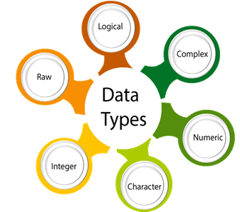
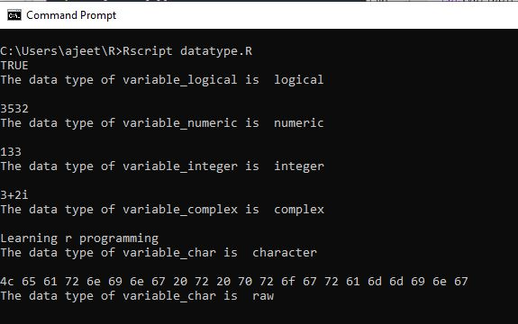

<table>
<tbody><tr><td>

<a class="next" href="r-data-structures">next →</a>
<a class="next" href="basic-syntax-of-r">← prev</a>

<h1 class="h1">Data Types in R Programming</h1>

In programming languages, we need to use various variables to store various information. Variables are the reserved memory location to store values. As we create a variable in our program, some space is reserved in memory.

In R, there are several data types such as integer, string, etc. The operating system allocates memory based on the data type of the variable and decides what can be stored in the reserved memory.

There are the following data types which are used in R programming:

 
<table class="alt">
<tbody><tr>
<th>Data type</th>
<th>Example</th>
<th>Description</th>
</tr>
<tr>
<td><strong>Logical</strong></td>
<td>True, False</td>
<td>It is a special data type for data with only two possible values which can be construed as true/false.</td>
</tr>
<tr>
<td><strong>Numeric</strong></td>
<td>12,32,112,5432</td>
<td>Decimal value is called numeric in R, and it is the default computational data type.</td>
</tr>
<tr>
<td><strong>Integer</strong></td>
<td>3L, 66L, 2346L</td>
<td>Here, L tells R to store the value as an integer,</td>
</tr>
<tr>
<td><strong>Complex</strong></td>
<td>Z=1+2i, t=7+3i</td>
<td>A complex value in R is defined as the pure imaginary value i.</td>
</tr>
<tr>
<td><strong>Character</strong></td>
<td>'a', '"good'", "TRUE", '35.4'</td>
<td>In R programming, a character is used to represent string values. We convert objects into character values with the help ofas.character() function.</td>
</tr>
<tr>
<td><strong>Raw</strong></td>
<td></td>
<td>A raw data type is used to holds raw bytes.</td>
</tr>
</tbody></table>

Let's see an example for better understanding of data types:
 table:eq(0) > tbody:eq(0) > tr:eq(0) > td:eq(0) > p:eq(3)" data-section-id="" data-ap-network="custom" style="display: block; clear: both; text-align: center; margin: 10px auto; width: 535px; height: 300px; overflow: hidden;"><!--  AP instream video tag Desktop -->

<video id="ap-player_html5_api" class="vjs-tech" playsinline="playsinline" preload="auto" tabindex="-1" muted="muted" src="blob:https://www.javatpoint.com/30f4e388-89ee-4a4f-b5eb-9f35c4d6dc88"></video>

Video Player is loading.

<button class="vjs-play-control vjs-control vjs-button" type="button" title="Play" aria-disabled="false" style="height: 15px; width: 40px;">Play</button><button class="vjs-control vjs-button vjs-next-control" type="button" aria-disabled="false" title="Next" style="height: 15px; width: 40px;">Next</button>
<button class="vjs-mute-control vjs-control vjs-button vjs-vol-0" type="button" title="Unmute" aria-disabled="false" style="height: 15px; width: 40px;">Unmute</button>

Current TimeÂ&nbsp;0:00

/

DurationÂ&nbsp;18:10

Loaded: 0.37%

00:00

Stream TypeÂ&nbsp;LIVE

<button class="vjs-seek-to-live-control vjs-control" type="button" title="Seek to live, currently behind live" aria-disabled="false">Seek to live, currently behind liveLIVE</button>
Remaining TimeÂ&nbsp;-18:10

Â&nbsp;

1x
<button class="vjs-playback-rate vjs-menu-button vjs-menu-button-popup vjs-button" type="button" aria-disabled="false" title="Playback Rate" aria-haspopup="true" aria-expanded="false" aria-describedby="vjs-playback-rate-value-label-ap-player_component_310">Playback Rate</button>
<ul class="vjs-menu-content"></ul>

<button class="vjs-chapters-button vjs-menu-button vjs-menu-button-popup vjs-button" type="button" aria-disabled="false" title="Chapters" aria-haspopup="true" aria-expanded="false">Chapters</button>
<ul class="vjs-menu-content"><li class="vjs-menu-title" tabindex="-1">Chapters</li></ul>

<button class="vjs-descriptions-button vjs-menu-button vjs-menu-button-popup vjs-button" type="button" aria-disabled="false" title="Descriptions" aria-haspopup="true" aria-expanded="false">Descriptions</button>
<ul class="vjs-menu-content"><li class="vjs-menu-item vjs-selected" tabindex="-1" role="menuitemradio" aria-disabled="false" aria-checked="true">descriptions off, selected</li></ul>

<button class="vjs-subs-caps-button vjs-menu-button vjs-menu-button-popup vjs-button" type="button" aria-disabled="false" title="Captions" aria-haspopup="true" aria-expanded="false">Captions</button>
<ul class="vjs-menu-content"><li class="vjs-menu-item vjs-texttrack-settings" tabindex="-1" role="menuitem" aria-disabled="false">captions settings, opens captions settings dialog</li><li class="vjs-menu-item vjs-selected" tabindex="-1" role="menuitemradio" aria-disabled="false" aria-checked="true">captions off, selected</li></ul>

<button class="vjs-audio-button vjs-menu-button vjs-menu-button-popup vjs-button" type="button" aria-disabled="false" title="Audio Track" aria-haspopup="true" aria-expanded="false">Audio Track</button>
<ul class="vjs-menu-content"><li class="vjs-menu-item vjs-selected vjs-main-menu-item" tabindex="-1" role="menuitemradio" aria-disabled="false" aria-checked="true">English, selected</li></ul>

<button class="vjs-fullscreen-control vjs-control vjs-button" type="button" title="Fullscreen" aria-disabled="false" style="height: 15px; width: 40px;">Fullscreen</button>

This is a modal window.

Beginning of dialog window. Escape will cancel and close the window.

<fieldset class="vjs-fg-color vjs-track-setting"><legend id="captions-text-legend-ap-player_component_520">Text</legend><label id="captions-foreground-color-ap-player_component_520" class="vjs-label">Color</label><select aria-labelledby="captions-text-legend-ap-player_component_520 captions-foreground-color-ap-player_component_520"><option id="captions-foreground-color-ap-player_component_520-White" value="#FFF" aria-labelledby="captions-text-legend-ap-player_component_520 captions-foreground-color-ap-player_component_520 captions-foreground-color-ap-player_component_520-White">White</option><option id="captions-foreground-color-ap-player_component_520-Black" value="#000" aria-labelledby="captions-text-legend-ap-player_component_520 captions-foreground-color-ap-player_component_520 captions-foreground-color-ap-player_component_520-Black">Black</option><option id="captions-foreground-color-ap-player_component_520-Red" value="#F00" aria-labelledby="captions-text-legend-ap-player_component_520 captions-foreground-color-ap-player_component_520 captions-foreground-color-ap-player_component_520-Red">Red</option><option id="captions-foreground-color-ap-player_component_520-Green" value="#0F0" aria-labelledby="captions-text-legend-ap-player_component_520 captions-foreground-color-ap-player_component_520 captions-foreground-color-ap-player_component_520-Green">Green</option><option id="captions-foreground-color-ap-player_component_520-Blue" value="#00F" aria-labelledby="captions-text-legend-ap-player_component_520 captions-foreground-color-ap-player_component_520 captions-foreground-color-ap-player_component_520-Blue">Blue</option><option id="captions-foreground-color-ap-player_component_520-Yellow" value="#FF0" aria-labelledby="captions-text-legend-ap-player_component_520 captions-foreground-color-ap-player_component_520 captions-foreground-color-ap-player_component_520-Yellow">Yellow</option><option id="captions-foreground-color-ap-player_component_520-Magenta" value="#F0F" aria-labelledby="captions-text-legend-ap-player_component_520 captions-foreground-color-ap-player_component_520 captions-foreground-color-ap-player_component_520-Magenta">Magenta</option><option id="captions-foreground-color-ap-player_component_520-Cyan" value="#0FF" aria-labelledby="captions-text-legend-ap-player_component_520 captions-foreground-color-ap-player_component_520 captions-foreground-color-ap-player_component_520-Cyan">Cyan</option></select><label id="captions-foreground-opacity-ap-player_component_520" class="vjs-label">Transparency</label><select aria-labelledby="captions-text-legend-ap-player_component_520 captions-foreground-opacity-ap-player_component_520"><option id="captions-foreground-opacity-ap-player_component_520-Opaque" value="1" aria-labelledby="captions-text-legend-ap-player_component_520 captions-foreground-opacity-ap-player_component_520 captions-foreground-opacity-ap-player_component_520-Opaque">Opaque</option><option id="captions-foreground-opacity-ap-player_component_520-SemiTransparent" value="0.5" aria-labelledby="captions-text-legend-ap-player_component_520 captions-foreground-opacity-ap-player_component_520 captions-foreground-opacity-ap-player_component_520-SemiTransparent">Semi-Transparent</option></select></fieldset><fieldset class="vjs-bg-color vjs-track-setting"><legend id="captions-background-ap-player_component_520">Background</legend><label id="captions-background-color-ap-player_component_520" class="vjs-label">Color</label><select aria-labelledby="captions-background-ap-player_component_520 captions-background-color-ap-player_component_520"><option id="captions-background-color-ap-player_component_520-Black" value="#000" aria-labelledby="captions-background-ap-player_component_520 captions-background-color-ap-player_component_520 captions-background-color-ap-player_component_520-Black">Black</option><option id="captions-background-color-ap-player_component_520-White" value="#FFF" aria-labelledby="captions-background-ap-player_component_520 captions-background-color-ap-player_component_520 captions-background-color-ap-player_component_520-White">White</option><option id="captions-background-color-ap-player_component_520-Red" value="#F00" aria-labelledby="captions-background-ap-player_component_520 captions-background-color-ap-player_component_520 captions-background-color-ap-player_component_520-Red">Red</option><option id="captions-background-color-ap-player_component_520-Green" value="#0F0" aria-labelledby="captions-background-ap-player_component_520 captions-background-color-ap-player_component_520 captions-background-color-ap-player_component_520-Green">Green</option><option id="captions-background-color-ap-player_component_520-Blue" value="#00F" aria-labelledby="captions-background-ap-player_component_520 captions-background-color-ap-player_component_520 captions-background-color-ap-player_component_520-Blue">Blue</option><option id="captions-background-color-ap-player_component_520-Yellow" value="#FF0" aria-labelledby="captions-background-ap-player_component_520 captions-background-color-ap-player_component_520 captions-background-color-ap-player_component_520-Yellow">Yellow</option><option id="captions-background-color-ap-player_component_520-Magenta" value="#F0F" aria-labelledby="captions-background-ap-player_component_520 captions-background-color-ap-player_component_520 captions-background-color-ap-player_component_520-Magenta">Magenta</option><option id="captions-background-color-ap-player_component_520-Cyan" value="#0FF" aria-labelledby="captions-background-ap-player_component_520 captions-background-color-ap-player_component_520 captions-background-color-ap-player_component_520-Cyan">Cyan</option></select><label id="captions-background-opacity-ap-player_component_520" class="vjs-label">Transparency</label><select aria-labelledby="captions-background-ap-player_component_520 captions-background-opacity-ap-player_component_520"><option id="captions-background-opacity-ap-player_component_520-Opaque" value="1" aria-labelledby="captions-background-ap-player_component_520 captions-background-opacity-ap-player_component_520 captions-background-opacity-ap-player_component_520-Opaque">Opaque</option><option id="captions-background-opacity-ap-player_component_520-SemiTransparent" value="0.5" aria-labelledby="captions-background-ap-player_component_520 captions-background-opacity-ap-player_component_520 captions-background-opacity-ap-player_component_520-SemiTransparent">Semi-Transparent</option><option id="captions-background-opacity-ap-player_component_520-Transparent" value="0" aria-labelledby="captions-background-ap-player_component_520 captions-background-opacity-ap-player_component_520 captions-background-opacity-ap-player_component_520-Transparent">Transparent</option></select></fieldset><fieldset class="vjs-window-color vjs-track-setting"><legend id="captions-window-ap-player_component_520">Window</legend><label id="captions-window-color-ap-player_component_520" class="vjs-label">Color</label><select aria-labelledby="captions-window-ap-player_component_520 captions-window-color-ap-player_component_520"><option id="captions-window-color-ap-player_component_520-Black" value="#000" aria-labelledby="captions-window-ap-player_component_520 captions-window-color-ap-player_component_520 captions-window-color-ap-player_component_520-Black">Black</option><option id="captions-window-color-ap-player_component_520-White" value="#FFF" aria-labelledby="captions-window-ap-player_component_520 captions-window-color-ap-player_component_520 captions-window-color-ap-player_component_520-White">White</option><option id="captions-window-color-ap-player_component_520-Red" value="#F00" aria-labelledby="captions-window-ap-player_component_520 captions-window-color-ap-player_component_520 captions-window-color-ap-player_component_520-Red">Red</option><option id="captions-window-color-ap-player_component_520-Green" value="#0F0" aria-labelledby="captions-window-ap-player_component_520 captions-window-color-ap-player_component_520 captions-window-color-ap-player_component_520-Green">Green</option><option id="captions-window-color-ap-player_component_520-Blue" value="#00F" aria-labelledby="captions-window-ap-player_component_520 captions-window-color-ap-player_component_520 captions-window-color-ap-player_component_520-Blue">Blue</option><option id="captions-window-color-ap-player_component_520-Yellow" value="#FF0" aria-labelledby="captions-window-ap-player_component_520 captions-window-color-ap-player_component_520 captions-window-color-ap-player_component_520-Yellow">Yellow</option><option id="captions-window-color-ap-player_component_520-Magenta" value="#F0F" aria-labelledby="captions-window-ap-player_component_520 captions-window-color-ap-player_component_520 captions-window-color-ap-player_component_520-Magenta">Magenta</option><option id="captions-window-color-ap-player_component_520-Cyan" value="#0FF" aria-labelledby="captions-window-ap-player_component_520 captions-window-color-ap-player_component_520 captions-window-color-ap-player_component_520-Cyan">Cyan</option></select><label id="captions-window-opacity-ap-player_component_520" class="vjs-label">Transparency</label><select aria-labelledby="captions-window-ap-player_component_520 captions-window-opacity-ap-player_component_520"><option id="captions-window-opacity-ap-player_component_520-Transparent" value="0" aria-labelledby="captions-window-ap-player_component_520 captions-window-opacity-ap-player_component_520 captions-window-opacity-ap-player_component_520-Transparent">Transparent</option><option id="captions-window-opacity-ap-player_component_520-SemiTransparent" value="0.5" aria-labelledby="captions-window-ap-player_component_520 captions-window-opacity-ap-player_component_520 captions-window-opacity-ap-player_component_520-SemiTransparent">Semi-Transparent</option><option id="captions-window-opacity-ap-player_component_520-Opaque" value="1" aria-labelledby="captions-window-ap-player_component_520 captions-window-opacity-ap-player_component_520 captions-window-opacity-ap-player_component_520-Opaque">Opaque</option></select></fieldset>

<fieldset class="vjs-font-percent vjs-track-setting"><legend id="captions-font-size-ap-player_component_520" class="">Font Size</legend><select aria-labelledby="captions-font-size-ap-player_component_520"><option id="captions-font-size-ap-player_component_520-50" value="0.50" aria-labelledby="captions-font-size-ap-player_component_520 captions-font-size-ap-player_component_520-50">50%</option><option id="captions-font-size-ap-player_component_520-75" value="0.75" aria-labelledby="captions-font-size-ap-player_component_520 captions-font-size-ap-player_component_520-75">75%</option><option id="captions-font-size-ap-player_component_520-100" value="1.00" aria-labelledby="captions-font-size-ap-player_component_520 captions-font-size-ap-player_component_520-100">100%</option><option id="captions-font-size-ap-player_component_520-125" value="1.25" aria-labelledby="captions-font-size-ap-player_component_520 captions-font-size-ap-player_component_520-125">125%</option><option id="captions-font-size-ap-player_component_520-150" value="1.50" aria-labelledby="captions-font-size-ap-player_component_520 captions-font-size-ap-player_component_520-150">150%</option><option id="captions-font-size-ap-player_component_520-175" value="1.75" aria-labelledby="captions-font-size-ap-player_component_520 captions-font-size-ap-player_component_520-175">175%</option><option id="captions-font-size-ap-player_component_520-200" value="2.00" aria-labelledby="captions-font-size-ap-player_component_520 captions-font-size-ap-player_component_520-200">200%</option><option id="captions-font-size-ap-player_component_520-300" value="3.00" aria-labelledby="captions-font-size-ap-player_component_520 captions-font-size-ap-player_component_520-300">300%</option><option id="captions-font-size-ap-player_component_520-400" value="4.00" aria-labelledby="captions-font-size-ap-player_component_520 captions-font-size-ap-player_component_520-400">400%</option></select></fieldset><fieldset class="vjs-edge-style vjs-track-setting"><legend id="ap-player_component_520" class="">Text Edge Style</legend><select aria-labelledby="ap-player_component_520"><option id="ap-player_component_520-None" value="none" aria-labelledby="ap-player_component_520 ap-player_component_520-None">None</option><option id="ap-player_component_520-Raised" value="raised" aria-labelledby="ap-player_component_520 ap-player_component_520-Raised">Raised</option><option id="ap-player_component_520-Depressed" value="depressed" aria-labelledby="ap-player_component_520 ap-player_component_520-Depressed">Depressed</option><option id="ap-player_component_520-Uniform" value="uniform" aria-labelledby="ap-player_component_520 ap-player_component_520-Uniform">Uniform</option><option id="ap-player_component_520-Dropshadow" value="dropshadow" aria-labelledby="ap-player_component_520 ap-player_component_520-Dropshadow">Dropshadow</option></select></fieldset><fieldset class="vjs-font-family vjs-track-setting"><legend id="captions-font-family-ap-player_component_520" class="">Font Family</legend><select aria-labelledby="captions-font-family-ap-player_component_520"><option id="captions-font-family-ap-player_component_520-ProportionalSansSerif" value="proportionalSansSerif" aria-labelledby="captions-font-family-ap-player_component_520 captions-font-family-ap-player_component_520-ProportionalSansSerif">Proportional Sans-Serif</option><option id="captions-font-family-ap-player_component_520-MonospaceSansSerif" value="monospaceSansSerif" aria-labelledby="captions-font-family-ap-player_component_520 captions-font-family-ap-player_component_520-MonospaceSansSerif">Monospace Sans-Serif</option><option id="captions-font-family-ap-player_component_520-ProportionalSerif" value="proportionalSerif" aria-labelledby="captions-font-family-ap-player_component_520 captions-font-family-ap-player_component_520-ProportionalSerif">Proportional Serif</option><option id="captions-font-family-ap-player_component_520-MonospaceSerif" value="monospaceSerif" aria-labelledby="captions-font-family-ap-player_component_520 captions-font-family-ap-player_component_520-MonospaceSerif">Monospace Serif</option><option id="captions-font-family-ap-player_component_520-Casual" value="casual" aria-labelledby="captions-font-family-ap-player_component_520 captions-font-family-ap-player_component_520-Casual">Casual</option><option id="captions-font-family-ap-player_component_520-Script" value="script" aria-labelledby="captions-font-family-ap-player_component_520 captions-font-family-ap-player_component_520-Script">Script</option><option id="captions-font-family-ap-player_component_520-SmallCaps" value="small-caps" aria-labelledby="captions-font-family-ap-player_component_520 captions-font-family-ap-player_component_520-SmallCaps">Small Caps</option></select></fieldset>

<button type="button" class="vjs-default-button" title="restore all settings to the default values">Reset restore all settings to the default values</button><button type="button" class="vjs-done-button">Done</button>

<button class="vjs-close-button vjs-control vjs-button" type="button" title="Close Modal Dialog" aria-disabled="false">Close Modal Dialog</button>
End of dialog window.

<button class="vjs-control vjs-button vjs-backward-skip-control" type="button" aria-disabled="false" title="Backward Skip 10s" style="height: calc(37.5px) !important;">Backward Skip 10s</button><button class="vjs-control vjs-button vjs-big-play-control" type="button" aria-disabled="false" title="Play Video" style="height: calc(66.6667px) !important; margin: 0px calc(41.1538px) !important;">Play Video</button><button class="vjs-control vjs-button vjs-big-pause-control" type="button" aria-disabled="false" title="Pause Video" style="height: calc(66.6667px) !important; margin: 0px calc(41.1538px) !important;">Pause Video</button><button class="vjs-control vjs-button vjs-forward-skip-control" type="button" aria-disabled="false" title="Forward Skip 10s" style="height: calc(37.5px) !important;">Forward Skip 10s</button>

<lima-video webkit-playsinline="true" playsinline="true" style="background-color: rgb(0, 0, 0); height: 100%; width: 100%; position: absolute; left: 0px; top: 0px;"></lima-video>

<lima-video webkit-playsinline="true" playsinline="true" style="background-color: rgb(0, 0, 0); height: 100%; width: 100%; position: absolute; left: 0px; top: 0px;"></lima-video>

<iframe src="https://imasdk.googleapis.com/js/core/bridge3.581.0_en.html#goog_1304200134" allowfullscreen="" allow="autoplay" id="goog_1304200134" data-gtm-yt-inspected-6="true" data-gtm-yt-inspected-15="true" style="border: 0px; opacity: 0; margin: 0px; padding: 0px; position: relative; color-scheme: light;"></iframe><iframe sandbox="allow-scripts allow-same-origin" data-gtm-yt-inspected-6="true" data-gtm-yt-inspected-15="true" style="display: none;"></iframe>

<svg xmlns="http://www.w3.org/2000/svg" fill="none" viewBox="0 0 24 24" stroke-width="1.5" stroke="currentColor" class="w-6 h-6" style="color: rgb(36, 31, 44); background: rgb(221, 221, 221); border-radius: 99999px; width: 20px !important;">
    <path stroke-linecap="round" stroke-linejoin="round" d="M9.75 9.75l4.5 4.5m0-4.5l-4.5 4.5M21 12a9 9 0 11-18 0 9 9 0 0118 0z"></path>
  </svg>
  

<ol start="1" class="dp-py"><li class="alt">#Logical&nbsp;Data&nbsp;type&nbsp;&nbsp;</li><li class="">variable_logical&lt;-&nbsp;TRUE&nbsp;&nbsp;</li><li class="alt">cat(variable_logical,"\n")&nbsp;&nbsp;</li><li class="">cat("The&nbsp;data&nbsp;type&nbsp;of&nbsp;variable_logical&nbsp;is&nbsp;",class(variable_logical),"\n\n")&nbsp;&nbsp;</li><li class="alt">&nbsp;&nbsp;</li><li class="">#Numeric&nbsp;Data&nbsp;type&nbsp;&nbsp;</li><li class="alt">variable_numeric&lt;-&nbsp;3532&nbsp;&nbsp;</li><li class="">cat(variable_numeric,"\n")&nbsp;&nbsp;&nbsp;&nbsp;&nbsp;</li><li class="alt">cat("The&nbsp;data&nbsp;type&nbsp;of&nbsp;variable_numeric&nbsp;is&nbsp;",class(variable_numeric),"\n\n")&nbsp;&nbsp;</li><li class="">&nbsp;&nbsp;</li><li class="alt">#Integer&nbsp;Data&nbsp;type&nbsp;&nbsp;</li><li class="">variable_integer&lt;-&nbsp;133L&nbsp;&nbsp;</li><li class="alt">cat(variable_integer,"\n")&nbsp;&nbsp;&nbsp;</li><li class="">cat("The&nbsp;data&nbsp;type&nbsp;of&nbsp;variable_integer&nbsp;is&nbsp;",class(variable_integer),"\n\n")&nbsp;&nbsp;</li><li class="alt">&nbsp;&nbsp;</li><li class="">#Complex&nbsp;Data&nbsp;type&nbsp;&nbsp;</li><li class="alt">variable_complex&lt;-&nbsp;3+2i&nbsp;&nbsp;</li><li class="">cat(variable_complex,"\n")&nbsp;&nbsp;</li><li class="alt">cat("The&nbsp;data&nbsp;type&nbsp;of&nbsp;variable_complex&nbsp;is&nbsp;",class(variable_complex),"\n\n")&nbsp;&nbsp;</li><li class="">&nbsp;&nbsp;</li><li class="alt">#Character&nbsp;Data&nbsp;type&nbsp;&nbsp;</li><li class="">variable_char&lt;-&nbsp;"Learning&nbsp;r&nbsp;programming"&nbsp;&nbsp;</li><li class="alt">cat(variable_char,"\n")&nbsp;&nbsp;</li><li class="">cat("The&nbsp;data&nbsp;type&nbsp;of&nbsp;variable_char&nbsp;is&nbsp;",class(variable_char),"\n\n")&nbsp;&nbsp;</li><li class="alt">&nbsp;&nbsp;</li><li class="">#Raw&nbsp;Data&nbsp;type&nbsp;&nbsp;</li><li class="alt">variable_raw&lt;-&nbsp;charToRaw("Learning&nbsp;r&nbsp;programming")&nbsp;&nbsp;</li><li class="">cat(variable_raw,"\n")&nbsp;&nbsp;</li><li class="alt">cat("The&nbsp;data&nbsp;type&nbsp;of&nbsp;variable_char&nbsp;is&nbsp;",class(variable_raw),"\n\n")&nbsp;&nbsp;</li></ol>
<textarea name="code" class="python" style="display: none;">#Logical Data type
variable_logical&lt;- TRUE
cat(variable_logical,"\n")
cat("The data type of variable_logical is ",class(variable_logical),"\n\n")

#Numeric Data type
variable_numeric&lt;- 3532
cat(variable_numeric,"\n")   
cat("The data type of variable_numeric is ",class(variable_numeric),"\n\n")

#Integer Data type
variable_integer&lt;- 133L
cat(variable_integer,"\n") 
cat("The data type of variable_integer is ",class(variable_integer),"\n\n")

#Complex Data type
variable_complex&lt;- 3+2i
cat(variable_complex,"\n")
cat("The data type of variable_complex is ",class(variable_complex),"\n\n")

#Character Data type
variable_char&lt;- "Learning r programming"
cat(variable_char,"\n")
cat("The data type of variable_char is ",class(variable_char),"\n\n")

#Raw Data type
variable_raw&lt;- charToRaw("Learning r programming")
cat(variable_raw,"\n")
cat("The data type of variable_char is ",class(variable_raw),"\n\n")
</textarea>

When we execute the following program, it will give us the following output:

 

  

  

  

 table:eq(0) > tbody:eq(0) > tr:eq(0) > td:eq(0)" data-section-id="" data-ap-network="adpTags" data-render-time="1689707047923" style="display: block; clear: both; text-align: center; margin: 10px auto 30px; width: 0px; height: 0px; overflow: hidden;">

 

</td></tr>
</tbody></table>

