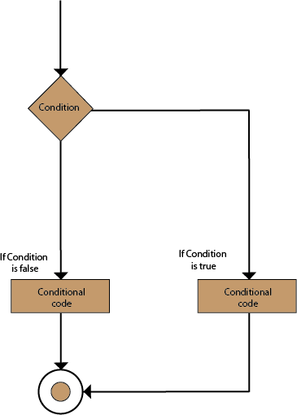
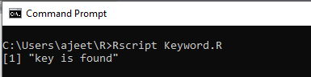
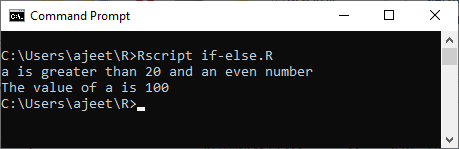
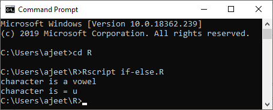

<table>

<tbody><tr><td>
 
<h1 class="h1">If-else statement</h1>

In the if statement, the inner code is executed when the condition is true. The code which is outside the if block will be executed when the if condition is false.

There is another type of decision-making statement known as the if-else statement. An if-else statement is the if statement followed by an else statement. An if-else statement, else statement will be executed when the boolean expression will false. In simple words, If a Boolean expression will have true value, then the if block gets executed otherwise, the else block will get executed.

R programming treats any non-zero and non-null values as true, and if the value is either zero or null, then it treats them as false.

The basic syntax of If-else statement is as follows:<
   

 <iframe class="pl-ps-frame svelte-1kly348" height="250" id="sm_preloader" width="300" src="" style="transform: scale(0.673307); border: none; background-color: transparent;"></iframe>  

<ol start="1" class="dp-j"><li class="alt">if(boolean_expression)&nbsp;{&nbsp;&nbsp;</li><li class="">&nbsp;&nbsp;&nbsp;//&nbsp;statement(s)&nbsp;will&nbsp;be&nbsp;executed&nbsp;if&nbsp;the&nbsp;boolean&nbsp;expression&nbsp;is&nbsp;true.&nbsp;&nbsp;</li><li class="alt">}&nbsp;else&nbsp;{&nbsp;&nbsp;</li><li class="">&nbsp;&nbsp;&nbsp;//&nbsp;statement(s)&nbsp;will&nbsp;be&nbsp;executed&nbsp;if&nbsp;the&nbsp;boolean&nbsp;expression&nbsp;is&nbsp;false.&nbsp;&nbsp;</li><li class="alt">}&nbsp;&nbsp;</li></ol>
<textarea name="code" class="java" style="display: none;">if(boolean_expression) {
   // statement(s) will be executed if the boolean expression is true.
} else {
   // statement(s) will be executed if the boolean expression is false.
}
</textarea>

<strong>Flow Chart</strong>

<h3 class="h3">Example 1</h3>

<ol start="1" class="dp-j"><li class="alt">#&nbsp;local&nbsp;variable&nbsp;definition&nbsp;&nbsp;</li><li class="">a&lt;-&nbsp;100&nbsp;&nbsp;</li><li class="alt">#checking&nbsp;boolean&nbsp;condition&nbsp;&nbsp;</li><li class="">if(a&lt;20){&nbsp;&nbsp;</li><li class="alt">&nbsp;&nbsp;&nbsp;&nbsp;#&nbsp;if&nbsp;the&nbsp;condition&nbsp;is&nbsp;true&nbsp;then&nbsp;print&nbsp;the&nbsp;following&nbsp;&nbsp;</li><li class="">&nbsp;&nbsp;&nbsp;&nbsp;cat("a&nbsp;is&nbsp;less&nbsp;than&nbsp;20\n")&nbsp;&nbsp;</li><li class="alt">}else{&nbsp;&nbsp;</li><li class="">&nbsp;&nbsp;&nbsp;&nbsp;#&nbsp;if&nbsp;the&nbsp;condition&nbsp;is&nbsp;false&nbsp;then&nbsp;print&nbsp;the&nbsp;following&nbsp;&nbsp;</li><li class="alt">&nbsp;&nbsp;&nbsp;&nbsp;cat("a&nbsp;is&nbsp;not&nbsp;less&nbsp;than&nbsp;20\n")&nbsp;&nbsp;</li><li class="">}&nbsp;&nbsp;</li><li class="alt">cat("The&nbsp;value&nbsp;of&nbsp;a&nbsp;is",&nbsp;a)&nbsp;&nbsp;</li></ol>
<textarea name="code" class="java" style="display: none;"># local variable definition
a&lt;- 100
#checking boolean condition
if(a&lt;20){
	# if the condition is true then print the following
	cat("a is less than 20\n")
}else{
	# if the condition is false then print the following
	cat("a is not less than 20\n")
}
cat("The value of a is", a)
</textarea>

<strong>Output:</strong>

<h3 class="h3">Example 2</h3>

<ol start="1" class="dp-j"><li class="alt">x&nbsp;&lt;-&nbsp;c("Hardwork","is","the","key","of","success")&nbsp;&nbsp;</li><li class="">&nbsp;&nbsp;</li><li class="alt">if("key"&nbsp;%in%&nbsp;x)&nbsp;{&nbsp;&nbsp;&nbsp;&nbsp;</li><li class="">&nbsp;&nbsp;&nbsp;print("key&nbsp;is&nbsp;found")&nbsp;&nbsp;</li><li class="alt">}&nbsp;else&nbsp;{&nbsp;&nbsp;</li><li class="">&nbsp;&nbsp;&nbsp;print("key&nbsp;is&nbsp;not&nbsp;found")&nbsp;&nbsp;</li><li class="alt">}&nbsp;&nbsp;</li></ol>
<textarea name="code" class="java" style="display: none;">x &lt;- c("Hardwork","is","the","key","of","success")

if("key" %in% x) {	
   print("key is found")
} else {
   print("key is not found")
}
</textarea>

<strong>Output:</strong>

<h3 class="h3">Example 3</h3>

<ol start="1" class="dp-j"><li class="alt">a&lt;-&nbsp;100&nbsp;&nbsp;</li><li class="">#checking&nbsp;boolean&nbsp;condition&nbsp;&nbsp;</li><li class="alt">if(a&lt;20){&nbsp;&nbsp;</li><li class="">&nbsp;&nbsp;&nbsp;&nbsp;cat("a&nbsp;is&nbsp;less&nbsp;than&nbsp;20")&nbsp;&nbsp;</li><li class="alt">&nbsp;&nbsp;&nbsp;&nbsp;if(a%%2==0){&nbsp;&nbsp;</li><li class="">&nbsp;&nbsp;&nbsp;&nbsp;&nbsp;&nbsp;&nbsp;&nbsp;cat("&nbsp;and&nbsp;an&nbsp;even&nbsp;number\n")&nbsp;&nbsp;</li><li class="alt">&nbsp;&nbsp;&nbsp;&nbsp;}&nbsp;&nbsp;</li><li class="">&nbsp;&nbsp;&nbsp;&nbsp;else{&nbsp;&nbsp;</li><li class="alt">&nbsp;&nbsp;&nbsp;&nbsp;&nbsp;&nbsp;&nbsp;&nbsp;cat("&nbsp;but&nbsp;not&nbsp;an&nbsp;even&nbsp;number\n")&nbsp;&nbsp;</li><li class="">&nbsp;&nbsp;&nbsp;&nbsp;}&nbsp;&nbsp;</li><li class="alt">}else{&nbsp;&nbsp;</li><li class="">&nbsp;&nbsp;&nbsp;&nbsp;cat("a&nbsp;is&nbsp;greater&nbsp;than&nbsp;20")&nbsp;&nbsp;</li><li class="alt">&nbsp;&nbsp;&nbsp;&nbsp;if(a%%2==0){&nbsp;&nbsp;</li><li class="">&nbsp;&nbsp;&nbsp;&nbsp;&nbsp;&nbsp;&nbsp;&nbsp;cat("&nbsp;and&nbsp;an&nbsp;even&nbsp;number\n")&nbsp;&nbsp;</li><li class="alt">&nbsp;&nbsp;&nbsp;&nbsp;}&nbsp;&nbsp;</li><li class="">&nbsp;&nbsp;&nbsp;&nbsp;else{&nbsp;&nbsp;</li><li class="alt">&nbsp;&nbsp;&nbsp;&nbsp;&nbsp;&nbsp;&nbsp;&nbsp;cat("&nbsp;but&nbsp;not&nbsp;an&nbsp;even&nbsp;number\n")&nbsp;&nbsp;</li><li class="">&nbsp;&nbsp;&nbsp;&nbsp;}&nbsp;&nbsp;</li><li class="alt">}&nbsp;&nbsp;</li></ol>
<textarea name="code" class="java" style="display: none;">a&lt;- 100
#checking boolean condition
if(a&lt;20){
	cat("a is less than 20")
	if(a%%2==0){
		cat(" and an even number\n")
	}
	else{
		cat(" but not an even number\n")
	}
}else{
	cat("a is greater than 20")
	if(a%%2==0){
		cat(" and an even number\n")
	}
	else{
		cat(" but not an even number\n")
	}
}
</textarea>

<strong>Output:</strong>

<h3 class="h3">Example 4</h3>

<ol start="1" class="dp-j"><li class="alt">a&lt;-&nbsp;'u'&nbsp;&nbsp;</li><li class="">if(a=='a'||a=='e'||a=='i'||a=='o'||a=='u'||a=='A'||a=='E'||a=='I'||a=='O'||a=='U'){&nbsp;&nbsp;</li><li class="alt">&nbsp;&nbsp;&nbsp;&nbsp;cat("character&nbsp;is&nbsp;a&nbsp;vowel\n")&nbsp;&nbsp;&nbsp;&nbsp;&nbsp;</li><li class="">}else{&nbsp;&nbsp;</li><li class="alt">&nbsp;&nbsp;&nbsp;&nbsp;cat("character&nbsp;is&nbsp;a&nbsp;constant")&nbsp;&nbsp;</li><li class="">}&nbsp;&nbsp;</li><li class="alt">cat("character&nbsp;is&nbsp;=",a)&nbsp;&nbsp;</li><li class="">}&nbsp;&nbsp;</li></ol>
<textarea name="code" class="java" style="display: none;">a&lt;- 'u'
if(a=='a'||a=='e'||a=='i'||a=='o'||a=='u'||a=='A'||a=='E'||a=='I'||a=='O'||a=='U'){
	cat("character is a vowel\n")	
}else{
	cat("character is a constant")
}
cat("character is =",a)
}
</textarea>

<strong>Output:</strong>

<h3 class="h3">Example 5</h3>

<ol start="1" class="dp-j"><li class="alt">a&lt;-&nbsp;'u'&nbsp;&nbsp;</li><li class="">if(a=='a'||a=='e'||a=='i'||a=='o'||a=='u'||a=='A'||a=='E'||a=='I'||a=='O'||a=='U'){&nbsp;&nbsp;</li><li class="alt">&nbsp;&nbsp;&nbsp;&nbsp;cat("character&nbsp;is&nbsp;a&nbsp;vowel\n")&nbsp;&nbsp;&nbsp;&nbsp;&nbsp;</li><li class="">}else{&nbsp;&nbsp;</li><li class="alt">&nbsp;&nbsp;&nbsp;&nbsp;cat("character&nbsp;is&nbsp;a&nbsp;constant")&nbsp;&nbsp;</li><li class="">}&nbsp;&nbsp;</li><li class="alt">cat("character&nbsp;is&nbsp;=",a)&nbsp;&nbsp;</li><li class="">}&nbsp;&nbsp;</li></ol>
<textarea name="code" class="java" style="display: none;">a&lt;- 'u'
if(a=='a'||a=='e'||a=='i'||a=='o'||a=='u'||a=='A'||a=='E'||a=='I'||a=='O'||a=='U'){
	cat("character is a vowel\n")	
}else{
	cat("character is a constant")
}
cat("character is =",a)
}
</textarea>

<strong>Output:</strong>

Next Topic<a href="r-else-if-statement">else if statement</a>

  

 

  

 table:eq(0) > tbody:eq(0) > tr:eq(0) > td:eq(0)" data-section-id="" data-ap-network="adpTags" data-render-time="1689708303257" style="display: block; clear: both; text-align: center; margin: 10px auto 30px; width: 0px; height: 0px; overflow: hidden;" data-refresh-time="1689708656871" data-timeout="8877">

</td></tr>
</tbody></table>" stroke-linecap="round" stroke-width="133.87" fill="none"><path id="path2991" d="m176.51 362.87 356.13 356.13"></path><path id="path2993" d="m532.64 362.87-356.13 356.13"></path></g></g><metadata><rdf:rdf><cc:work><dc:format>image/svg+xml</dc:format><dc:type rdf:resource="http://purl.org/dc/dcmitype/StillImage"></dc:type><cc:license rdf:resource="http://creativecommons.org/licenses/publicdomain/"></cc:license><dc:publisher><cc:agent rdf:about="http://openclipart.org/"><dc:title>Openclipart</dc:title></cc:agent></dc:publisher><dc:title>Close Button</dc:title><dc:date>2013-09-18T11:23:45</dc:date><dc:description>A round black close button with a white, thick, X in the center.
                        </dc:description><dc:source>https://openclipart.org/detail/183568/close-button-by-henrikhoff-183568</dc:source><dc:creator><cc:agent><dc:title>henrikhoff</dc:title></cc:agent></dc:creator><dc:subject><rdf:bag><rdf:li>black</rdf:li><rdf:li>close button</rdf:li><rdf:li>cross</rdf:li><rdf:li>icon</rdf:li><rdf:li>white</rdf:li><rdf:li>x</rdf:li></rdf:bag></dc:subject></cc:work><cc:license rdf:about="http://creativecommons.org/licenses/publicdomain/"><cc:permits rdf:resource="http://creativecommons.org/ns#Reproduction"></cc:permits><cc:permits rdf:resource="http://creativecommons.org/ns#Distribution"></cc:permits><cc:permits rdf:resource="http://creativecommons.org/ns#DerivativeWorks"></cc:permits></cc:license></rdf:rdf></metadata></svg>

 

 <iframe class="ad-manager-frame hidden svelte-17qie27" id="frame_0" width="100%" height="100%" src="about:blank"></iframe><iframe class="ad-manager-frame hidden svelte-17qie27" id="frame_1" width="100%" height="100%" src="about:blank"></iframe><iframe class="ad-manager-frame hidden svelte-17qie27" id="frame_2" width="100%" height="100%" src="about:blank"></iframe><iframe class="ad-manager-frame hidden svelte-17qie27" id="frame_3" width="100%" height="100%" src="about:blank"></iframe><iframe class="ad-manager-frame hidden svelte-17qie27" id="frame_4" width="100%" height="100%" src="about:blank"></iframe><iframe class="ad-manager-frame hidden svelte-17qie27" id="frame_5" width="100%" height="100%" src="about:blank"></iframe><iframe class="ad-manager-frame hidden svelte-17qie27" id="frame_6" width="100%" height="100%" src="about:blank"></iframe><iframe class="ad-manager-frame hidden svelte-17qie27" id="frame_7" width="100%" height="100%" src="about:blank"></iframe><iframe class="ad-manager-frame hidden svelte-17qie27" id="frame_8" width="100%" height="100%" src="about:blank"></iframe><iframe class="ad-manager-frame hidden svelte-17qie27" id="frame_9" width="100%" height="100%" src="about:blank"></iframe><iframe class="ad-manager-frame hidden svelte-17qie27" id="frame_10" width="100%" height="100%" src="about:blank"></iframe><iframe class="ad-manager-frame hidden svelte-17qie27" id="frame_11" width="100%" height="100%" src="about:blank"></iframe><iframe class="ad-manager-frame hidden svelte-17qie27" id="frame_12" width="100%" height="100%" src="about:blank"></iframe><iframe class="ad-manager-frame hidden svelte-17qie27" id="frame_13" width="100%" height="100%" src="about:blank"></iframe><iframe class="ad-manager-frame hidden svelte-17qie27" id="frame_14" width="100%" height="100%" src="about:blank"></iframe><iframe class="ad-manager-frame hidden svelte-17qie27" id="frame_15" width="100%" height="100%" src="about:blank"></iframe><iframe class="ad-manager-frame hidden svelte-17qie27" id="frame_16" width="100%" height="100%" src="about:blank"></iframe><iframe class="ad-manager-frame hidden svelte-17qie27" id="frame_17" width="100%" height="100%" src="about:blank"></iframe><iframe class="ad-manager-frame hidden svelte-17qie27" id="frame_18" width="100%" height="100%" src="about:blank"></iframe><iframe class="ad-manager-frame hidden svelte-17qie27" id="frame_19" width="100%" height="100%" src="about:blank"></iframe>
    

 <iframe class="pl-ps-frame svelte-1kly348" height="250" id="sm_preloader" width="300" src="" style="transform: scale(0.673307); border: none; background-color: transparent;"></iframe>  

<ol start="1" class="dp-j"><li class="alt">if(boolean_expression)&nbsp;{&nbsp;&nbsp;</li><li class="">&nbsp;&nbsp;&nbsp;//&nbsp;statement(s)&nbsp;will&nbsp;be&nbsp;executed&nbsp;if&nbsp;the&nbsp;boolean&nbsp;expression&nbsp;is&nbsp;true.&nbsp;&nbsp;</li><li class="alt">}&nbsp;else&nbsp;{&nbsp;&nbsp;</li><li class="">&nbsp;&nbsp;&nbsp;//&nbsp;statement(s)&nbsp;will&nbsp;be&nbsp;executed&nbsp;if&nbsp;the&nbsp;boolean&nbsp;expression&nbsp;is&nbsp;false.&nbsp;&nbsp;</li><li class="alt">}&nbsp;&nbsp;</li></ol>
<textarea name="code" class="java" style="display: none;">if(boolean_expression) {
   // statement(s) will be executed if the boolean expression is true.
} else {
   // statement(s) will be executed if the boolean expression is false.
}
</textarea>

<strong>Flow Chart</strong>

<h3 class="h3">Example 1</h3>

<ol start="1" class="dp-j"><li class="alt">#&nbsp;local&nbsp;variable&nbsp;definition&nbsp;&nbsp;</li><li class="">a&lt;-&nbsp;100&nbsp;&nbsp;</li><li class="alt">#checking&nbsp;boolean&nbsp;condition&nbsp;&nbsp;</li><li class="">if(a&lt;20){&nbsp;&nbsp;</li><li class="alt">&nbsp;&nbsp;&nbsp;&nbsp;#&nbsp;if&nbsp;the&nbsp;condition&nbsp;is&nbsp;true&nbsp;then&nbsp;print&nbsp;the&nbsp;following&nbsp;&nbsp;</li><li class="">&nbsp;&nbsp;&nbsp;&nbsp;cat("a&nbsp;is&nbsp;less&nbsp;than&nbsp;20\n")&nbsp;&nbsp;</li><li class="alt">}else{&nbsp;&nbsp;</li><li class="">&nbsp;&nbsp;&nbsp;&nbsp;#&nbsp;if&nbsp;the&nbsp;condition&nbsp;is&nbsp;false&nbsp;then&nbsp;print&nbsp;the&nbsp;following&nbsp;&nbsp;</li><li class="alt">&nbsp;&nbsp;&nbsp;&nbsp;cat("a&nbsp;is&nbsp;not&nbsp;less&nbsp;than&nbsp;20\n")&nbsp;&nbsp;</li><li class="">}&nbsp;&nbsp;</li><li class="alt">cat("The&nbsp;value&nbsp;of&nbsp;a&nbsp;is",&nbsp;a)&nbsp;&nbsp;</li></ol>
<textarea name="code" class="java" style="display: none;"># local variable definition
a&lt;- 100
#checking boolean condition
if(a&lt;20){
	# if the condition is true then print the following
	cat("a is less than 20\n")
}else{
	# if the condition is false then print the following
	cat("a is not less than 20\n")
}
cat("The value of a is", a)
</textarea>

<strong>Output:</strong>

<h3 class="h3">Example 2</h3>

<ol start="1" class="dp-j"><li class="alt">x&nbsp;&lt;-&nbsp;c("Hardwork","is","the","key","of","success")&nbsp;&nbsp;</li><li class="">&nbsp;&nbsp;</li><li class="alt">if("key"&nbsp;%in%&nbsp;x)&nbsp;{&nbsp;&nbsp;&nbsp;&nbsp;</li><li class="">&nbsp;&nbsp;&nbsp;print("key&nbsp;is&nbsp;found")&nbsp;&nbsp;</li><li class="alt">}&nbsp;else&nbsp;{&nbsp;&nbsp;</li><li class="">&nbsp;&nbsp;&nbsp;print("key&nbsp;is&nbsp;not&nbsp;found")&nbsp;&nbsp;</li><li class="alt">}&nbsp;&nbsp;</li></ol>
<textarea name="code" class="java" style="display: none;">x &lt;- c("Hardwork","is","the","key","of","success")

if("key" %in% x) {	
   print("key is found")
} else {
   print("key is not found")
}
</textarea>

<strong>Output:</strong>

<h3 class="h3">Example 3</h3>

<ol start="1" class="dp-j"><li class="alt">a&lt;-&nbsp;100&nbsp;&nbsp;</li><li class="">#checking&nbsp;boolean&nbsp;condition&nbsp;&nbsp;</li><li class="alt">if(a&lt;20){&nbsp;&nbsp;</li><li class="">&nbsp;&nbsp;&nbsp;&nbsp;cat("a&nbsp;is&nbsp;less&nbsp;than&nbsp;20")&nbsp;&nbsp;</li><li class="alt">&nbsp;&nbsp;&nbsp;&nbsp;if(a%%2==0){&nbsp;&nbsp;</li><li class="">&nbsp;&nbsp;&nbsp;&nbsp;&nbsp;&nbsp;&nbsp;&nbsp;cat("&nbsp;and&nbsp;an&nbsp;even&nbsp;number\n")&nbsp;&nbsp;</li><li class="alt">&nbsp;&nbsp;&nbsp;&nbsp;}&nbsp;&nbsp;</li><li class="">&nbsp;&nbsp;&nbsp;&nbsp;else{&nbsp;&nbsp;</li><li class="alt">&nbsp;&nbsp;&nbsp;&nbsp;&nbsp;&nbsp;&nbsp;&nbsp;cat("&nbsp;but&nbsp;not&nbsp;an&nbsp;even&nbsp;number\n")&nbsp;&nbsp;</li><li class="">&nbsp;&nbsp;&nbsp;&nbsp;}&nbsp;&nbsp;</li><li class="alt">}else{&nbsp;&nbsp;</li><li class="">&nbsp;&nbsp;&nbsp;&nbsp;cat("a&nbsp;is&nbsp;greater&nbsp;than&nbsp;20")&nbsp;&nbsp;</li><li class="alt">&nbsp;&nbsp;&nbsp;&nbsp;if(a%%2==0){&nbsp;&nbsp;</li><li class="">&nbsp;&nbsp;&nbsp;&nbsp;&nbsp;&nbsp;&nbsp;&nbsp;cat("&nbsp;and&nbsp;an&nbsp;even&nbsp;number\n")&nbsp;&nbsp;</li><li class="alt">&nbsp;&nbsp;&nbsp;&nbsp;}&nbsp;&nbsp;</li><li class="">&nbsp;&nbsp;&nbsp;&nbsp;else{&nbsp;&nbsp;</li><li class="alt">&nbsp;&nbsp;&nbsp;&nbsp;&nbsp;&nbsp;&nbsp;&nbsp;cat("&nbsp;but&nbsp;not&nbsp;an&nbsp;even&nbsp;number\n")&nbsp;&nbsp;</li><li class="">&nbsp;&nbsp;&nbsp;&nbsp;}&nbsp;&nbsp;</li><li class="alt">}&nbsp;&nbsp;</li></ol>
<textarea name="code" class="java" style="display: none;">a&lt;- 100
#checking boolean condition
if(a&lt;20){
	cat("a is less than 20")
	if(a%%2==0){
		cat(" and an even number\n")
	}
	else{
		cat(" but not an even number\n")
	}
}else{
	cat("a is greater than 20")
	if(a%%2==0){
		cat(" and an even number\n")
	}
	else{
		cat(" but not an even number\n")
	}
}
</textarea>

<strong>Output:</strong>

<h3 class="h3">Example 4</h3>

<ol start="1" class="dp-j"><li class="alt">a&lt;-&nbsp;'u'&nbsp;&nbsp;</li><li class="">if(a=='a'||a=='e'||a=='i'||a=='o'||a=='u'||a=='A'||a=='E'||a=='I'||a=='O'||a=='U'){&nbsp;&nbsp;</li><li class="alt">&nbsp;&nbsp;&nbsp;&nbsp;cat("character&nbsp;is&nbsp;a&nbsp;vowel\n")&nbsp;&nbsp;&nbsp;&nbsp;&nbsp;</li><li class="">}else{&nbsp;&nbsp;</li><li class="alt">&nbsp;&nbsp;&nbsp;&nbsp;cat("character&nbsp;is&nbsp;a&nbsp;constant")&nbsp;&nbsp;</li><li class="">}&nbsp;&nbsp;</li><li class="alt">cat("character&nbsp;is&nbsp;=",a)&nbsp;&nbsp;</li><li class="">}&nbsp;&nbsp;</li></ol>
<textarea name="code" class="java" style="display: none;">a&lt;- 'u'
if(a=='a'||a=='e'||a=='i'||a=='o'||a=='u'||a=='A'||a=='E'||a=='I'||a=='O'||a=='U'){
	cat("character is a vowel\n")	
}else{
	cat("character is a constant")
}
cat("character is =",a)
}
</textarea>

<strong>Output:</strong>

<h3 class="h3">Example 5</h3>

<ol start="1" class="dp-j"><li class="alt">a&lt;-&nbsp;'u'&nbsp;&nbsp;</li><li class="">if(a=='a'||a=='e'||a=='i'||a=='o'||a=='u'||a=='A'||a=='E'||a=='I'||a=='O'||a=='U'){&nbsp;&nbsp;</li><li class="alt">&nbsp;&nbsp;&nbsp;&nbsp;cat("character&nbsp;is&nbsp;a&nbsp;vowel\n")&nbsp;&nbsp;&nbsp;&nbsp;&nbsp;</li><li class="">}else{&nbsp;&nbsp;</li><li class="alt">&nbsp;&nbsp;&nbsp;&nbsp;cat("character&nbsp;is&nbsp;a&nbsp;constant")&nbsp;&nbsp;</li><li class="">}&nbsp;&nbsp;</li><li class="alt">cat("character&nbsp;is&nbsp;=",a)&nbsp;&nbsp;</li><li class="">}&nbsp;&nbsp;</li></ol>
<textarea name="code" class="java" style="display: none;">a&lt;- 'u'
if(a=='a'||a=='e'||a=='i'||a=='o'||a=='u'||a=='A'||a=='E'||a=='I'||a=='O'||a=='U'){
	cat("character is a vowel\n")	
}else{
	cat("character is a constant")
}
cat("character is =",a)
}
</textarea>

<strong>Output:</strong>

 
  
 
  

 table:eq(0) > tbody:eq(0) > tr:eq(0) > td:eq(0)" data-section-id="" data-ap-network="adpTags" data-render-time="1689708303257" style="display: block; clear: both; text-align: center; margin: 10px auto 30px; width: 0px; height: 0px; overflow: hidden;" data-refresh-time="1689708528988" data-timeout="6712">

 

</td></tr>
</tbody></table>