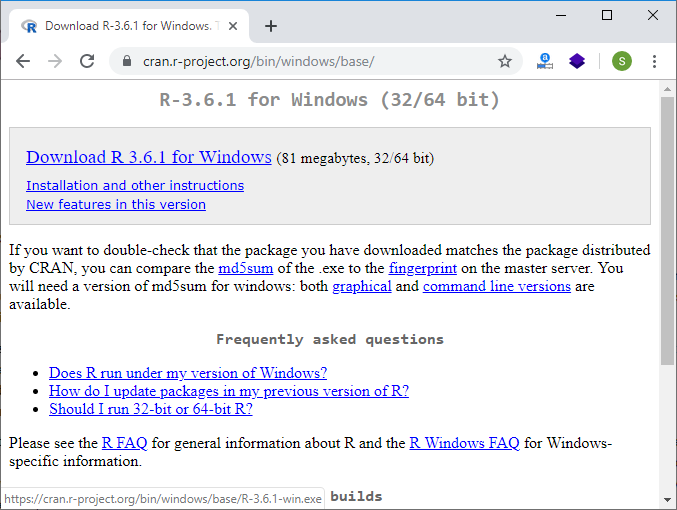
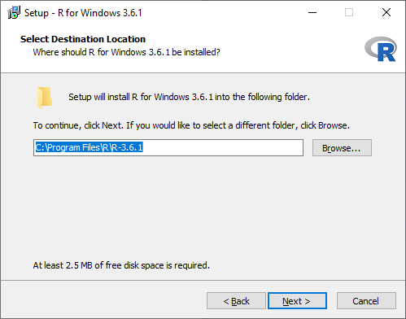
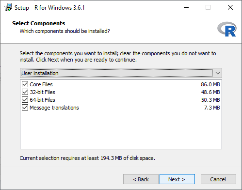
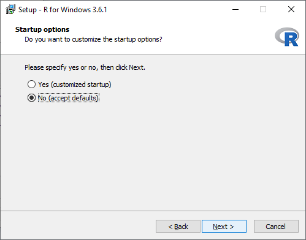
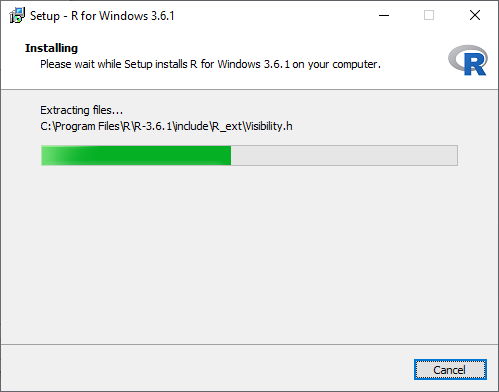
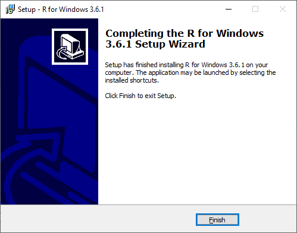
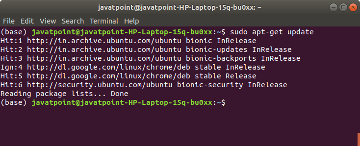
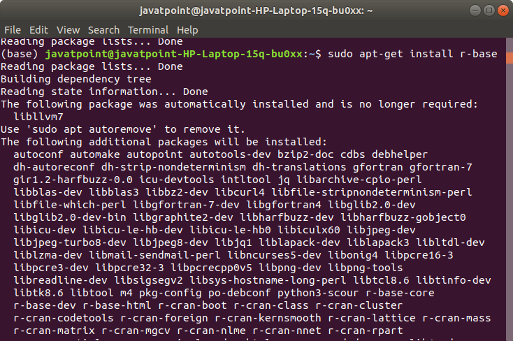
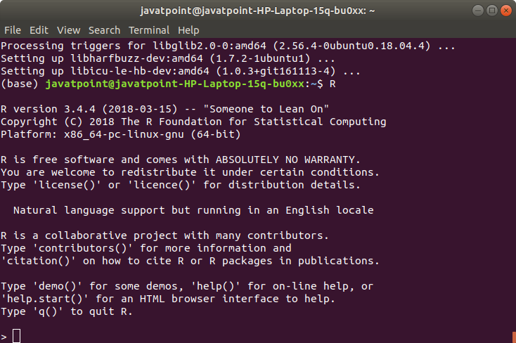

<table>
<tbody><tr><td>

<a class="next" href="rstudio-ide">next →</a>
<a class="next" href="r-tutorial">← prev</a>

<h1 class="h1">Installation of R</h1>

<strong>R programming</strong> is a very popular language and to work on that we have to install two things, i.e., R and RStudio. R and RStudio works together to create a project on R.

Installing R to the local computer is very easy. First, we must know which operating system we are using so that we can download it accordingly.

The official site  

 

<h3 class="h2">Install R in Windows</h3>

There are following steps used to install the R in Windows:

<strong>Step 1:</strong>

First, we have to download the R setup from <a href="https://cloud.r-project.org/bin/windows/base/" rel="nofollow" target="_blank">https://cloud.r-project.org/bin/windows/base/</a>.

 

<strong>Step 2:</strong>

When we click on <strong>Download R 3.6.1 for windows</strong>, our downloading will be started of R setup. Once the downloading is finished, we have to run the setup of R in the following way:

1) Select the path where we want to download the R and proceed to Next.

 

2) Select all components which we want to install, and then we will proceed to <strong>Next</strong>.

 

3) In the next step, we have to select either customized startup or accept the default, and then we proceed to <strong>Next</strong>.
 table:eq(0) > tbody:eq(0) > tr:eq(0) > td:eq(0) > p:eq(11)" data-section-id="" data-ap-network="adpTags" data-render-time="1689705898210" style="display: block; clear: both; text-align: center; margin: 10px auto 20px; width: 0px; height: 0px; overflow: hidden;">

 

4) When we proceed to next, our installation of R in our system will get started:

 

5) In the last, we will click on finish to successfully install R in our system.

<h3 class="h2">Install R in Linux</h3>

There are only three steps to install R in Linux 

<strong>Step 1:</strong>

In the first step, we have to update all the required files in our system using <strong>sudo apt-get update</strong> command as:
 table:eq(0) > tbody:eq(0) > tr:eq(0) > td:eq(0) > p:eq(16)" data-section-id="" data-ap-network="adpTags" data-render-time="1689705898218" style="display: block; clear: both; text-align: center; margin: 10px auto 50px; width: 0px; height: 0px; overflow: hidden;">

 

<strong>Step 2:</strong>

In the second step, we will install R file in our system with the help of <strong>sudo apt-get install r-base</strong> as:

 

<strong>Step 3:</strong>
 table:eq(0) > tbody:eq(0) > tr:eq(0) > td:eq(0) > p:eq(19)" data-section-id="" data-ap-network="adpTags" data-render-time="1689705898202" style="display: block; clear: both; text-align: center; margin: 10px auto; width: 0px; height: 0px; overflow: hidden;">

In the last step, we type R and press enter to work on R editor.

 
  

 

  

 table:eq(0) > tbody:eq(0) > tr:eq(0) > td:eq(0)" data-section-id="" data-ap-network="adpTags" data-render-time="1689705898233" style="display: block; clear: both; text-align: center; margin: 10px auto 30px; width: 0px; height: 0px; overflow: hidden;">

 

</td></tr>
</tbody></table>

