

<table>
<tbody><tr><td>

 

<h1 class="h1">Keywords in R Programming</h1>

In programming, a keyword is a word which is reserved by a program because it has a special meaning. A keyword can be a command or a parameter. Like in C, C++, Java, there is also a set of keywords in R. A keyword can't be used as a variable name. Keywords are also called as "reserved names."

There are the following keywords as per <strong>?reserved</strong> or <strong>help(reserved)</strong> command:

<table class="alt">
<tbody><tr>
<td>if</td>
<td>else</td>
<td>repeat</td>
</tr>
<tr>
<td>while</td>
<td>function</td>
<td>for</td>
</tr>
<tr>
<td>next</td>
<td>break</td>
<td>TRUE</td>
</tr>
<tr>
<td>FALSE</td>
<td>NULL</td>
<td>Inf</td>
</tr>
<tr>
<td>NaN</td>
<td>NA</td>
<td>NA_integer_</td>
</tr>
<tr>
<td>NA_real_</td>
<td>NA_complex_</td>
<td>NA_character_</td>
</tr>
</tbody></table>
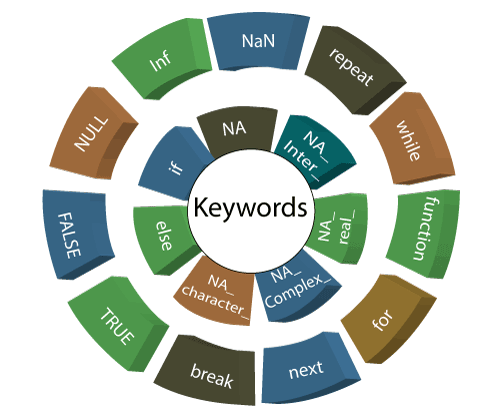
<h3 class="h3">1) if</h3>

The if statement consists of a Boolean expression which is followed by one or more statements. In R, if statement is the simplest conditional statement which is used to decide whether a block of the statement will be executed or not.

<strong>Example:</strong>
 table:eq(0) > tbody:eq(0) > tr:eq(0) > td:eq(0) > p:eq(3)" data-section-id="" data-ap-network="custom" style="display: block; clear: both; text-align: center; margin: 10px auto; width: 535px; height: 300px; overflow: hidden;"><!--  AP instream video tag Desktop -->

<svg viewBox="0 0 744.09 1052.4" width="20px" height="20px"><g id="layer1"><path id="path2989" d="m814.29 606.65a314.29 314.29 0 1 1 -628.57 0 314.29 314.29 0 1 1 628.57 0z" stroke="#000" stroke-width="5" transform="matrix(1.1048 0 0 1.1048 -179.21 -162.53)"></path><g id="g3763" transform="matrix(.91837 0 0 .91837 47.587 10.944)" stroke="#fff" stroke-linecap="round" stroke-width="133.87" fill="none"><path id="path2991" d="m176.51 362.87 356.13 356.13"></path><path id="path2993" d="m532.64 362.87-356.13 356.13"></path></g></g><metadata><rdf:rdf><cc:work><dc:format>image/svg+xml</dc:format><dc:type rdf:resource="http://purl.org/dc/dcmitype/StillImage"></dc:type><cc:license rdf:resource="http://creativecommons.org/licenses/publicdomain/"></cc:license><dc:publisher><cc:agent rdf:about="http://openclipart.org/"><dc:title>Openclipart</dc:title></cc:agent></dc:publisher><dc:title>Close Button</dc:title><dc:date>2013-09-18T11:23:45</dc:date><dc:description>A round black close button with a white, thick, X in the center.
                        </dc:description><dc:source>https://openclipart.org/detail/183568/close-button-by-henrikhoff-183568</dc:source><dc:creator><cc:agent><dc:title>henrikhoff</dc:title></cc:agent></dc:creator><dc:subject><rdf:bag><rdf:li>black</rdf:li><rdf:li>close button</rdf:li><rdf:li>cross</rdf:li><rdf:li>icon</rdf:li><rdf:li>white</rdf:li><rdf:li>x</rdf:li></rdf:bag></dc:subject></cc:work><cc:license rdf:about="http://creativecommons.org/licenses/publicdomain/"><cc:permits rdf:resource="http://creativecommons.org/ns#Reproduction"></cc:permits><cc:permits rdf:resource="http://creativecommons.org/ns#Distribution"></cc:permits><cc:permits rdf:resource="http://creativecommons.org/ns#DerivativeWorks"></cc:permits></cc:license></rdf:rdf></metadata></svg>

 

 <iframe class="ad-manager-frame hidden svelte-17qie27" id="frame_0" width="100%" height="100%" src="about:blank"></iframe><iframe class="ad-manager-frame hidden svelte-17qie27" id="frame_1" width="100%" height="100%" src="about:blank"></iframe><iframe class="ad-manager-frame hidden svelte-17qie27" id="frame_2" width="100%" height="100%" src="about:blank"></iframe><iframe class="ad-manager-frame hidden svelte-17qie27" id="frame_3" width="100%" height="100%" src="about:blank"></iframe><iframe class="ad-manager-frame hidden svelte-17qie27" id="frame_4" width="100%" height="100%" src="about:blank"></iframe><iframe class="ad-manager-frame hidden svelte-17qie27" id="frame_5" width="100%" height="100%" src="about:blank"></iframe><iframe class="ad-manager-frame hidden svelte-17qie27" id="frame_6" width="100%" height="100%" src="about:blank"></iframe><iframe class="ad-manager-frame hidden svelte-17qie27" id="frame_7" width="100%" height="100%" src="about:blank"></iframe><iframe class="ad-manager-frame hidden svelte-17qie27" id="frame_8" width="100%" height="100%" src="about:blank"></iframe><iframe class="ad-manager-frame hidden svelte-17qie27" id="frame_9" width="100%" height="100%" src="about:blank"></iframe><iframe class="ad-manager-frame hidden svelte-17qie27" id="frame_10" width="100%" height="100%" src="about:blank"></iframe><iframe class="ad-manager-frame hidden svelte-17qie27" id="frame_11" width="100%" height="100%" src="about:blank"></iframe><iframe class="ad-manager-frame hidden svelte-17qie27" id="frame_12" width="100%" height="100%" src="about:blank"></iframe><iframe class="ad-manager-frame hidden svelte-17qie27" id="frame_13" width="100%" height="100%" src="about:blank"></iframe><iframe class="ad-manager-frame hidden svelte-17qie27" id="frame_14" width="100%" height="100%" src="about:blank"></iframe><iframe class="ad-manager-frame hidden svelte-17qie27" id="frame_15" width="100%" height="100%" src="about:blank"></iframe><iframe class="ad-manager-frame hidden svelte-17qie27" id="frame_16" width="100%" height="100%" src="about:blank"></iframe><iframe class="ad-manager-frame hidden svelte-17qie27" id="frame_17" width="100%" height="100%" src="about:blank"></iframe><iframe class="ad-manager-frame hidden svelte-17qie27" id="frame_18" width="100%" height="100%" src="about:blank"></iframe><iframe class="ad-manager-frame hidden svelte-17qie27" id="frame_19" width="100%" height="100%" src="about:blank"></iframe>
    

 <iframe class="pl-ps-frame svelte-1kly348" height="250" id="sm_preloader" width="300" src="" style="transform: scale(0.673307); border: none; background-color: transparent;"></iframe>  

<ol start="1" class="dp-py"><li class="alt">a&lt;-11&nbsp;&nbsp;</li><li class="">if(a&lt;15)&nbsp;&nbsp;</li><li class="alt">+&nbsp;print("I&nbsp;am&nbsp;lesser&nbsp;than&nbsp;15")&nbsp;&nbsp;</li></ol>
<textarea name="code" class="python" style="display: none;">a&lt;-11
if(a&lt;15)
+ print("I am lesser than 15")
</textarea>

<strong>Output:</strong>

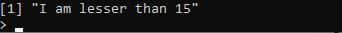
<h3 class="h3">2) else</h3>

The R else statement is associated with if statement. When the if statement's condition is false only then else block will be executed. Let see an example to make it clear:

<strong>Example:</strong>

<ol start="1" class="dp-py"><li class="alt">a&lt;-22&nbsp;&nbsp;</li><li class="">if(a&lt;20){&nbsp;&nbsp;</li><li class="alt">&nbsp;&nbsp;&nbsp;&nbsp;cat("I&nbsp;am&nbsp;lesser&nbsp;than&nbsp;20")&nbsp;&nbsp;</li><li class="">}else{&nbsp;&nbsp;&nbsp;</li><li class="alt">&nbsp;&nbsp;&nbsp;&nbsp;cat("I&nbsp;am&nbsp;larger&nbsp;than&nbsp;20")&nbsp;&nbsp;</li><li class="">}&nbsp;&nbsp;</li></ol>
<textarea name="code" class="python" style="display: none;">a&lt;-22
if(a&lt;20){
	cat("I am lesser than 20")
}else{ 
	cat("I am larger than 20")
}
</textarea>

<strong>Output:</strong>

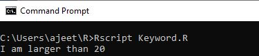
<h3 class="h3">3) repeat</h3>

The repeat keyword is used to iterate over a block of code multiple numbers of times. In R, repeat is a loop, and in this loop statement, there is no condition to exit from the loop. For exiting the loop, we will use the break statement.

<strong>Example:</strong>

<ol start="1" class="dp-py"><li class="alt">x&nbsp;&lt;-&nbsp;1&nbsp;&nbsp;</li><li class="">repeat&nbsp;{&nbsp;&nbsp;</li><li class="alt">&nbsp;&nbsp;&nbsp;&nbsp;cat(x)&nbsp;&nbsp;</li><li class="">&nbsp;&nbsp;&nbsp;&nbsp;x&nbsp;=&nbsp;x+1&nbsp;&nbsp;</li><li class="alt">if&nbsp;(x&nbsp;==&nbsp;6){&nbsp;&nbsp;</li><li class="">&nbsp;&nbsp;&nbsp;&nbsp;&nbsp;&nbsp;&nbsp;&nbsp;break&nbsp;&nbsp;</li><li class="alt">&nbsp;&nbsp;&nbsp;&nbsp;}&nbsp;&nbsp;</li><li class="">}&nbsp;&nbsp;</li></ol>
<textarea name="code" class="python" style="display: none;">x &lt;- 1
repeat {
	cat(x)
	x = x+1
if (x == 6){
		break
	}
}
</textarea>

<strong>Output:</strong>

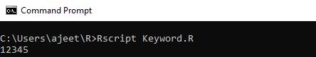
<h3 class="h3">4) while</h3>

A while keyword is used as a loop. The while loop is executed until the given condition is true. This is also used to make an infinite loop.
 table:eq(0) > tbody:eq(0) > tr:eq(0) > td:eq(0) > p:eq(11)" data-section-id="" data-ap-network="adpTags" data-render-time="1689707414206" style="display: block; clear: both; text-align: center; margin: 10px auto 20px; width: 0px; height: 0px; overflow: hidden;">

<strong>Example:</strong>

<ol start="1" class="dp-py"><li class="alt">a&nbsp;&lt;-&nbsp;20&nbsp;&nbsp;</li><li class="">while(a!=0){&nbsp;&nbsp;</li><li class="alt">&nbsp;&nbsp;&nbsp;&nbsp;&nbsp;&nbsp;cat(a)&nbsp;&nbsp;</li><li class="">&nbsp;&nbsp;&nbsp;&nbsp;&nbsp;&nbsp;a&nbsp;=&nbsp;a-2&nbsp;&nbsp;</li><li class="alt">}&nbsp;&nbsp;&nbsp;&nbsp;&nbsp;</li></ol>
<textarea name="code" class="python" style="display: none;">a &lt;- 20
while(a!=0){
      cat(a)
      a = a-2
}	
</textarea>

<strong>Output:</strong>

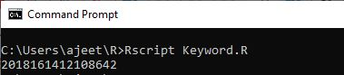
<h3 class="h3">5) function</h3>

A function is an object in R programming. The keyword function is used to create a user-define function in R. R has some pre-defined functions also, such as seq, mean, and sum.

<strong>Example:</strong>

<ol start="1" class="dp-py"><li class="alt">new.function&lt;-&nbsp;function(n)&nbsp;{&nbsp;&nbsp;</li><li class="">&nbsp;&nbsp;&nbsp;for(i&nbsp;in&nbsp;1:n)&nbsp;{&nbsp;&nbsp;</li><li class="alt">&nbsp;&nbsp;&nbsp;&nbsp;&nbsp;&nbsp;a&nbsp;&lt;-&nbsp;i^2&nbsp;&nbsp;</li><li class="">&nbsp;&nbsp;&nbsp;&nbsp;&nbsp;&nbsp;print(a)&nbsp;&nbsp;</li><li class="alt">&nbsp;&nbsp;&nbsp;}&nbsp;&nbsp;</li><li class="">}&nbsp;&nbsp;</li><li class="alt">new.function(6)&nbsp;&nbsp;</li></ol>
<textarea name="code" class="python" style="display: none;">new.function&lt;- function(n) {
   for(i in 1:n) {
      a &lt;- i^2
      print(a)
   }
}
new.function(6)
</textarea>

<strong>Output:</strong>
 table:eq(0) > tbody:eq(0) > tr:eq(0) > td:eq(0) > p:eq(16)" data-section-id="" data-ap-network="adpTags" data-render-time="1689707414215" style="display: block; clear: both; text-align: center; margin: 10px auto 50px; width: 0px; height: 0px; overflow: hidden;">

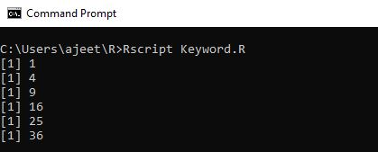
<h3 class="h3">6) for</h3>

The <strong>for</strong> is a keyword which is used for looping or iterating over a sequence (dictionary, string, list, set or tuple).

We can execute a set of a statement once for each item in the iterator (list, set, tuple, etc.) with the help of for loop.

<strong>Example:</strong>
 table:eq(0) > tbody:eq(0) > tr:eq(0) > td:eq(0) > p:eq(19)" data-section-id="" data-ap-network="adpTags" data-render-time="1689707414198" style="display: block; clear: both; text-align: center; margin: 10px auto; width: 0px; height: 0px; overflow: hidden;">

<ol start="1" class="dp-py"><li class="alt">v&nbsp;&lt;-&nbsp;LETTERS[1:4]&nbsp;&nbsp;</li><li class="">for&nbsp;(&nbsp;i&nbsp;in&nbsp;v)&nbsp;{&nbsp;&nbsp;</li><li class="alt">&nbsp;&nbsp;&nbsp;print(i)&nbsp;&nbsp;</li><li class="">}&nbsp;&nbsp;</li></ol>
<textarea name="code" class="python" style="display: none;">v &lt;- LETTERS[1:4]
for ( i in v) {
   print(i)
}
</textarea>

<strong>Output:</strong>

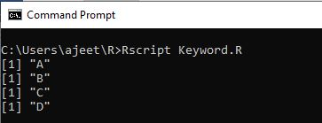
<h3 class="h3">7) next</h3>

The next keyword skips the current iteration of a loop without terminating it. When R parser found next, it skips further evaluation and starts the new iteration of the loop. 

<strong>Example:</strong>

<ol start="1" class="dp-py"><li class="alt">v&nbsp;&lt;-&nbsp;LETTERS[1:6]&nbsp;&nbsp;</li><li class="">for&nbsp;(&nbsp;i&nbsp;in&nbsp;v)&nbsp;{&nbsp;&nbsp;</li><li class="alt">if&nbsp;(i&nbsp;==&nbsp;"D")&nbsp;{&nbsp;&nbsp;</li><li class="">&nbsp;&nbsp;&nbsp;&nbsp;&nbsp;&nbsp;&nbsp;&nbsp;next&nbsp;&nbsp;</li><li class="alt">}&nbsp;&nbsp;</li><li class="">&nbsp;&nbsp;&nbsp;&nbsp;print(i)&nbsp;&nbsp;</li><li class="alt">}&nbsp;&nbsp;</li></ol>
<textarea name="code" class="python" style="display: none;">v &lt;- LETTERS[1:6]
for ( i in v) {
if (i == "D") {
		next
}
	print(i)
}
</textarea>

<strong>Output:</strong>

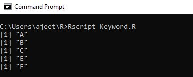
<h3 class="h3">8) break</h3>

The <strong>break</strong> keyword is used to terminate the loop if the condition is true. The control of the program firstly passes to the outer statement then passes to the body of the break statement.

<strong>Example:</strong>

<ol start="1" class="dp-py"><li class="alt">n&lt;-1&nbsp;&nbsp;</li><li class="">while(n&lt;10){&nbsp;&nbsp;</li><li class="alt">if(n==3)&nbsp;&nbsp;</li><li class="">&nbsp;&nbsp;&nbsp;&nbsp;&nbsp;&nbsp;&nbsp;&nbsp;break&nbsp;&nbsp;</li><li class="alt">n=n+1&nbsp;&nbsp;</li><li class="">cat(n,"\n")&nbsp;&nbsp;</li><li class="alt">}&nbsp;&nbsp;</li><li class="">cat("End&nbsp;of&nbsp;the&nbsp;program")&nbsp;&nbsp;</li></ol>
<textarea name="code" class="python" style="display: none;">n&lt;-1
while(n&lt;10){
if(n==3)
		break
n=n+1
cat(n,"\n")
}
cat("End of the program")
</textarea>

<strong>Output:</strong>

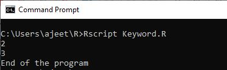
<h3 class="h3">9) TRUE/FALSE</h3>

The TRUE and FALSE keywords are used to represent a Boolean true and Boolean false. If the given statement is true, then the interpreter returns true else the interpreter returns false.

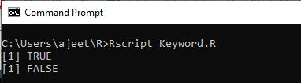
<h3 class="h3">10) NULL</h3>

In R, NULL represents the null object. NULL is used to represent missing and undefined values. NULL is the logical representation of a statement which is neither TRUE nor FALSE.
 table:eq(0) > tbody:eq(0) > tr:eq(0) > td:eq(0) > p:eq(28)" data-section-id="" data-ap-network="adpTags" data-render-time="1689707414211" style="display: block; clear: both; text-align: center; margin: 10px auto; width: 0px; height: 0px; overflow: hidden;">

<strong>Example:</strong>

<ol start="1" class="dp-py"><li class="alt">as.null(list(a&nbsp;=&nbsp;1,&nbsp;b&nbsp;=&nbsp;"c"))&nbsp;&nbsp;</li></ol>
<textarea name="code" class="python" style="display: none;">as.null(list(a = 1, b = "c"))
</textarea>

<strong>Output:</strong>

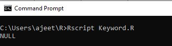
<h3 class="h3">11) Inf and NaN</h3>

The is.finite and is.infinite function returns a vector of the same length indicating which elements are finite or infinite.

Inf and -Inf are positive and negative infinity. NaN stands for 'Not a Number.' NaN applies on numeric values and real and imaginary parts of complex values, but it will not apply to the values of integer vectors.

<strong>Usage</strong>
 table:eq(0) > tbody:eq(0) > tr:eq(0) > td:eq(0) > p:eq(33)" data-section-id="" data-ap-network="adpTags" data-render-time="1689707414201" style="display: block; clear: both; text-align: center; margin: 10px auto; width: 0px; height: 0px; overflow: hidden;">

<ol start="1" class="dp-py"><li class="alt">is.finite(x)&nbsp;&nbsp;</li><li class="">is.infinite(x)&nbsp;&nbsp;</li><li class="alt">is.nan(x)&nbsp;&nbsp;</li><li class="">&nbsp;&nbsp;</li><li class="alt">Inf&nbsp;&nbsp;</li><li class="">NaN&nbsp;&nbsp;</li></ol>
<textarea name="code" class="python" style="display: none;">is.finite(x)
is.infinite(x)
is.nan(x)

Inf
NaN
</textarea>

<h3 class="h3">12) NA</h3>

NA is a logical constant of length 1 that contains a missing value indicator. It can be coerced to any other vector type except raw. There are other types of constant also, such as NA_Integer_, NA_real_, NA_complex_, and NA_character. These constants are of the other atomic vector type which supports missing values.

<strong>Usage</strong>

<ol start="1" class="dp-py"><li class="alt">NA&nbsp;&nbsp;</li><li class="">is.na(x)&nbsp;&nbsp;</li><li class="alt">anyNA(x,&nbsp;recursive&nbsp;=&nbsp;FALSE)&nbsp;&nbsp;</li><li class="">&nbsp;&nbsp;</li><li class="alt">##&nbsp;S3&nbsp;method&nbsp;for&nbsp;class&nbsp;'data.frame'&nbsp;&nbsp;</li><li class="">is.na(x)&nbsp;&nbsp;</li><li class="alt">&nbsp;&nbsp;</li><li class="">is.na(x)&nbsp;&lt;-&nbsp;value&nbsp;&nbsp;</li></ol>
<textarea name="code" class="python" style="display: none;">NA
is.na(x)
anyNA(x, recursive = FALSE)

## S3 method for class 'data.frame'
is.na(x)

is.na(x) &lt;- value
</textarea>

 

  

 

  

 table:eq(0) > tbody:eq(0) > tr:eq(0) > td:eq(0)" data-section-id="" data-ap-network="adpTags" data-render-time="1689707414226" style="display: block; clear: both; text-align: center; margin: 10px auto 30px; width: 0px; height: 0px; overflow: hidden;">

</td></tr>
</tbody></table>

