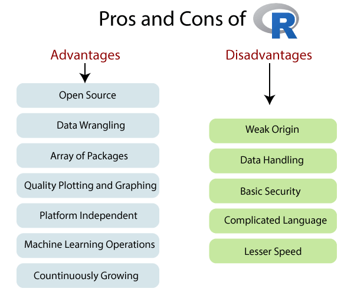

<table>
<tbody><tr><td>

 

<h1 class="h1">R Advantages and Disadvantages</h1>

R is the most popular programming language for statistical modeling and analysis. Like other programming languages, R also has some advantages and disadvantages. It is a continuously evolving language which means that many cons will slowly fade away with future updates to R.

There are the following pros and cons of R

<h2 class="h2">Pros</h2>
<h3 class="h3">1) Open Source</h3>

An open-source language is a language on which we can work without any need for a license or a fee. R is an open-source language. We can contribute to the development of R by optimizing our packages, developing new ones, and resolving issues.

<h3 class="h3">2) Platform Independent</h3>

R is a platform-independent language or cross-platform programming language which means its code can run on all operating systems. R enables programmers to develop software for several competing platforms by writing a program only once. R can run quite easily on Windows, Linux, and Mac.
 table:eq(0) > tbody:eq(0) > tr:eq(0) > td:eq(0) > p:eq(3)" data-section-id="" data-ap-network="custom" style="display: block; clear: both; text-align: center; margin: 10px auto; width: 535px; height: 300px; overflow: hidden;"><!--  AP instream video tag Desktop -->

 

 
Advertisement
 

<svg viewBox="0 0 744.09 1052.4" width="20px" height="20px"><g id="layer1"><path id="path2989" d="m814.29 606.65a314.29 314.29 0 1 1 -628.57 0 314.29 314.29 0 1 1 628.57 0z" stroke="#000" stroke-width="5" transform="matrix(1.1048 0 0 1.1048 -179.21 -162.53)"></path><g id="g3763" transform="matrix(.91837 0 0 .91837 47.587 10.944)" stroke="#fff" stroke-linecap="round" stroke-width="133.87" fill="none"><path id="path2991" d="m176.51 362.87 356.13 356.13"></path><path id="path2993" d="m532.64 362.87-356.13 356.13"></path></g></g><metadata><rdf:rdf><cc:work><dc:format>image/svg+xml</dc:format><dc:type rdf:resource="http://purl.org/dc/dcmitype/StillImage"></dc:type><cc:license rdf:resource="http://creativecommons.org/licenses/publicdomain/"></cc:license><dc:publisher><cc:agent rdf:about="http://openclipart.org/"><dc:title>Openclipart</dc:title></cc:agent></dc:publisher><dc:title>Close Button</dc:title><dc:date>2013-09-18T11:23:45</dc:date><dc:description>A round black close button with a white, thick, X in the center.
                        </dc:description><dc:source>https://openclipart.org/detail/183568/close-button-by-henrikhoff-183568</dc:source><dc:creator><cc:agent><dc:title>henrikhoff</dc:title></cc:agent></dc:creator><dc:subject><rdf:bag><rdf:li>black</rdf:li><rdf:li>close button</rdf:li><rdf:li>cross</rdf:li><rdf:li>icon</rdf:li><rdf:li>white</rdf:li><rdf:li>x</rdf:li></rdf:bag></dc:subject></cc:work><cc:license rdf:about="http://creativecommons.org/licenses/publicdomain/"><cc:permits rdf:resource="http://creativecommons.org/ns#Reproduction"></cc:permits><cc:permits rdf:resource="http://creativecommons.org/ns#Distribution"></cc:permits><cc:permits rdf:resource="http://creativecommons.org/ns#DerivativeWorks"></cc:permits></cc:license></rdf:rdf></metadata></svg>

 

 <iframe class="ad-manager-frame hidden svelte-17qie27" id="frame_0" width="100%" height="100%" src="about:blank"></iframe><iframe class="ad-manager-frame hidden svelte-17qie27" id="frame_1" width="100%" height="100%" src="about:blank"></iframe><iframe class="ad-manager-frame hidden svelte-17qie27" id="frame_2" width="100%" height="100%" src="about:blank"></iframe><iframe class="ad-manager-frame hidden svelte-17qie27" id="frame_3" width="100%" height="100%" src="about:blank"></iframe><iframe class="ad-manager-frame hidden svelte-17qie27" id="frame_4" width="100%" height="100%" src="about:blank"></iframe><iframe class="ad-manager-frame  svelte-17qie27" id="frame_5" width="100%" height="100%" src="about:blank"></iframe><iframe class="ad-manager-frame hidden svelte-17qie27" id="frame_6" width="100%" height="100%" src="about:blank"></iframe><iframe class="ad-manager-frame hidden svelte-17qie27" id="frame_7" width="100%" height="100%" src="about:blank"></iframe><iframe class="ad-manager-frame hidden svelte-17qie27" id="frame_8" width="100%" height="100%" src="about:blank"></iframe><iframe class="ad-manager-frame hidden svelte-17qie27" id="frame_9" width="100%" height="100%" src="about:blank"></iframe><iframe class="ad-manager-frame hidden svelte-17qie27" id="frame_10" width="100%" height="100%" src="about:blank"></iframe><iframe class="ad-manager-frame hidden svelte-17qie27" id="frame_11" width="100%" height="100%" src="about:blank"></iframe><iframe class="ad-manager-frame hidden svelte-17qie27" id="frame_12" width="100%" height="100%" src="about:blank"></iframe><iframe class="ad-manager-frame hidden svelte-17qie27" id="frame_13" width="100%" height="100%" src="about:blank"></iframe><iframe class="ad-manager-frame hidden svelte-17qie27" id="frame_14" width="100%" height="100%" src="about:blank"></iframe><iframe class="ad-manager-frame hidden svelte-17qie27" id="frame_15" width="100%" height="100%" src="about:blank"></iframe><iframe class="ad-manager-frame hidden svelte-17qie27" id="frame_16" width="100%" height="100%" src="about:blank"></iframe><iframe class="ad-manager-frame hidden svelte-17qie27" id="frame_17" width="100%" height="100%" src="about:blank"></iframe><iframe class="ad-manager-frame hidden svelte-17qie27" id="frame_18" width="100%" height="100%" src="about:blank"></iframe><iframe class="ad-manager-frame hidden svelte-17qie27" id="frame_19" width="100%" height="100%" src="about:blank"></iframe>
    

<h3 class="h3">3) Machine Learning Operations</h3>

R allows us to do various machine learning operations such as classification and regression. For this purpose, R provides various packages and features for developing the artificial neural network. R is used by the best data scientists in the world.

<h3 class="h3">4) Exemplary support for data wrangling</h3>

R allows us to perform data wrangling. R provides packages such as dplyr, readr which are capable of transforming messy data into a structured form.

<h3 class="h3">5) Quality plotting and graphing</h3>

R simplifies quality plotting and graphing. R libraries such as ggplot2 and plotly advocates for visually appealing and aesthetic graphs which set R apart from other programming languages.

<h3 class="h3">6) The array of packages</h3>

R has a rich set of packages. R has over 10,000 packages in the CRAN repository which are constantly growing. R provides packages for data science and machine learning operations.

<h3 class="h3">7) Statistics</h3>

R is mainly known as the language of statistics. It is the main reason why R is predominant than other programming languages for the development of statistical tools.

<h3 class="h3">8) Continuously Growing</h3>

R is a constantly evolving programming language. Constantly evolving means when something evolves, it changes or develops over time, like our taste in music and clothes, which evolve as we get older. R is a state of the art which provides updates whenever any new feature is added.

<h2 class="h2">Cons</h2>
<h3 class="h3">1) Data Handling</h3>

In R, objects are stored in physical memory. It is in contrast with other programming languages like Python. R utilizes more memory as compared to Python. It requires the entire data in one single place which is in the memory. It is not an ideal option when we deal with Big Data.

<h3 class="h3">2) Basic Security</h3>

R lacks basic security. It is an essential part of most programming languages such as Python. Because of this, there are many restrictions with R as it cannot be embedded in a web-application.
 table:eq(0) > tbody:eq(0) > tr:eq(0) > td:eq(0) > p:eq(11)" data-section-id="" data-ap-network="adpTags" data-render-time="1689706510290" style="display: block; clear: both; text-align: center; margin: 10px auto 20px; width: 0px; height: 0px; overflow: hidden;">

<h3 class="h3">3) Complicated Language</h3>

R is a very complicated language, and it has a steep learning curve. The people who don't have prior knowledge or programming experience may find it difficult to learn R.

<h3 class="h3">4) Weak Origin</h3>

The main disadvantage of R is, it does not have support for dynamic or 3D graphics. The reason behind this is its origin. It shares its origin with a much older programming language "S."

<h3 class="h3">5) Lesser Speed</h3>

R programming language is much slower than other programming languages such as MATLAB and Python. In comparison to other programming language, R packages are much slower.

In R, algorithms are spread across different packages. The programmers who have no prior knowledge of packages may find it difficult to implement algorithms.

  

 

  

 table:eq(0) > tbody:eq(0) > tr:eq(0) > td:eq(0)" data-section-id="" data-ap-network="adpTags" data-render-time="1689706510300" style="display: block; clear: both; text-align: center; margin: 10px auto 30px; width: 0px; height: 0px; overflow: hidden;">

 

</td></tr>
</tbody></table>

