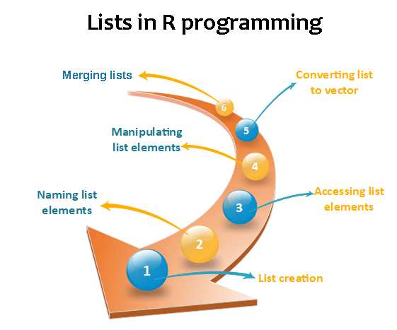

<table>
<tbody><tr><td>

 

<h1 class="h1">R Lists</h1>

In R, lists are the second type of vector. Lists are the objects of R which contain elements of different types such as number, vectors, string and another list inside it. It can also contain a function or a matrix as its elements. A list is a data structure which has components of mixed data types. We can say, a list is a generic vector which contains other objects. 

<h3 class="h3">Example</h3>

<ol start="1" class="dp-xml"><li class="alt">vec&nbsp;&lt;-&nbsp;c(3,4,5,6)&nbsp;&nbsp;</li><li class="">char_vec&lt;-c("shubham","nishka","gunjan","sumit")&nbsp;&nbsp;</li><li class="alt">logic_vec&lt;-c(TRUE,FALSE,FALSE,TRUE)&nbsp;&nbsp;</li><li class="">out_list&lt;-list(vec,char_vec,logic_vec)&nbsp;&nbsp;</li><li class="alt">out_list&nbsp;&nbsp;</li></ol>
<textarea name="code" class="html" style="display: none;">vec &lt;- c(3,4,5,6)
char_vec&lt;-c("shubham","nishka","gunjan","sumit")
logic_vec&lt;-c(TRUE,FALSE,FALSE,TRUE)
out_list&lt;-list(vec,char_vec,logic_vec)
out_list
</textarea>

<strong>Output:</strong>

<pre>[[1]]
[1] 3 4 5 6
[[2]]
[1] "shubham" "nishka"  "gunjan"  "sumit"
[[3]]
[1]  TRUE FALSE FALSE  TRUE
</pre>

 

<h2 class="h2">Lists creation</h2>

The process of creating a list is the same as a vector. In R, the vector is created with the help of c() function. Like c() function, there is another function, i.e., list() which is used to create a list in R. A list avoid the drawback of the vector which is data type. We can add the elements in the list of different data types. 

<strong>Syntax</strong>
 table:eq(0) > tbody:eq(0) > tr:eq(0) > td:eq(0) > p:eq(3)" data-section-id="" data-ap-network="custom" style="display: block; clear: both; text-align: center; margin: 10px auto; width: 535px; height: 300px; overflow: hidden;"><!--  AP instream video tag Desktop -->

<video id="ap-player_html5_api" class="vjs-tech" playsinline="playsinline" preload="auto" tabindex="-1" muted="muted" src="blob:https://www.javatpoint.com/ab2e24a4-1067-47d1-b012-a272aaf948eb"></video>

Video Player is loading.

<button class="vjs-play-control vjs-control vjs-button" type="button" title="Play" aria-disabled="false" style="height: 15px; width: 40px;">Play</button><button class="vjs-control vjs-button vjs-next-control" type="button" aria-disabled="false" title="Next" style="height: 15px; width: 40px;">Next</button>
<button class="vjs-mute-control vjs-control vjs-button vjs-vol-0" type="button" title="Unmute" aria-disabled="false" style="height: 15px; width: 40px;">Unmute</button>

Current TimeÂ&nbsp;0:00

/

DurationÂ&nbsp;18:10

Loaded: 0.37%

00:00

Stream TypeÂ&nbsp;LIVE

<button class="vjs-seek-to-live-control vjs-control" type="button" title="Seek to live, currently behind live" aria-disabled="false">Seek to live, currently behind liveLIVE</button>
Remaining TimeÂ&nbsp;-18:10

Â&nbsp;

1x
<button class="vjs-playback-rate vjs-menu-button vjs-menu-button-popup vjs-button" type="button" aria-disabled="false" title="Playback Rate" aria-haspopup="true" aria-expanded="false" aria-describedby="vjs-playback-rate-value-label-ap-player_component_310">Playback Rate</button>
<ul class="vjs-menu-content"></ul>

<button class="vjs-chapters-button vjs-menu-button vjs-menu-button-popup vjs-button" type="button" aria-disabled="false" title="Chapters" aria-haspopup="true" aria-expanded="false">Chapters</button>
<ul class="vjs-menu-content"><li class="vjs-menu-title" tabindex="-1">Chapters</li></ul>

<button class="vjs-descriptions-button vjs-menu-button vjs-menu-button-popup vjs-button" type="button" aria-disabled="false" title="Descriptions" aria-haspopup="true" aria-expanded="false">Descriptions</button>
<ul class="vjs-menu-content"><li class="vjs-menu-item vjs-selected" tabindex="-1" role="menuitemradio" aria-disabled="false" aria-checked="true">descriptions off, selected</li></ul>

<button class="vjs-subs-caps-button vjs-menu-button vjs-menu-button-popup vjs-button" type="button" aria-disabled="false" title="Captions" aria-haspopup="true" aria-expanded="false">Captions</button>
<ul class="vjs-menu-content"><li class="vjs-menu-item vjs-texttrack-settings" tabindex="-1" role="menuitem" aria-disabled="false">captions settings, opens captions settings dialog</li><li class="vjs-menu-item vjs-selected" tabindex="-1" role="menuitemradio" aria-disabled="false" aria-checked="true">captions off, selected</li></ul>

<button class="vjs-audio-button vjs-menu-button vjs-menu-button-popup vjs-button" type="button" aria-disabled="false" title="Audio Track" aria-haspopup="true" aria-expanded="false">Audio Track</button>
<ul class="vjs-menu-content"><li class="vjs-menu-item vjs-selected vjs-main-menu-item" tabindex="-1" role="menuitemradio" aria-disabled="false" aria-checked="true">English, selected</li></ul>

<button class="vjs-fullscreen-control vjs-control vjs-button" type="button" title="Fullscreen" aria-disabled="false" style="height: 15px; width: 40px;">Fullscreen</button>

This is a modal window.

Beginning of dialog window. Escape will cancel and close the window.

<fieldset class="vjs-fg-color vjs-track-setting"><legend id="captions-text-legend-ap-player_component_520">Text</legend><label id="captions-foreground-color-ap-player_component_520" class="vjs-label">Color</label><select aria-labelledby="captions-text-legend-ap-player_component_520 captions-foreground-color-ap-player_component_520"><option id="captions-foreground-color-ap-player_component_520-White" value="#FFF" aria-labelledby="captions-text-legend-ap-player_component_520 captions-foreground-color-ap-player_component_520 captions-foreground-color-ap-player_component_520-White">White</option><option id="captions-foreground-color-ap-player_component_520-Black" value="#000" aria-labelledby="captions-text-legend-ap-player_component_520 captions-foreground-color-ap-player_component_520 captions-foreground-color-ap-player_component_520-Black">Black</option><option id="captions-foreground-color-ap-player_component_520-Red" value="#F00" aria-labelledby="captions-text-legend-ap-player_component_520 captions-foreground-color-ap-player_component_520 captions-foreground-color-ap-player_component_520-Red">Red</option><option id="captions-foreground-color-ap-player_component_520-Green" value="#0F0" aria-labelledby="captions-text-legend-ap-player_component_520 captions-foreground-color-ap-player_component_520 captions-foreground-color-ap-player_component_520-Green">Green</option><option id="captions-foreground-color-ap-player_component_520-Blue" value="#00F" aria-labelledby="captions-text-legend-ap-player_component_520 captions-foreground-color-ap-player_component_520 captions-foreground-color-ap-player_component_520-Blue">Blue</option><option id="captions-foreground-color-ap-player_component_520-Yellow" value="#FF0" aria-labelledby="captions-text-legend-ap-player_component_520 captions-foreground-color-ap-player_component_520 captions-foreground-color-ap-player_component_520-Yellow">Yellow</option><option id="captions-foreground-color-ap-player_component_520-Magenta" value="#F0F" aria-labelledby="captions-text-legend-ap-player_component_520 captions-foreground-color-ap-player_component_520 captions-foreground-color-ap-player_component_520-Magenta">Magenta</option><option id="captions-foreground-color-ap-player_component_520-Cyan" value="#0FF" aria-labelledby="captions-text-legend-ap-player_component_520 captions-foreground-color-ap-player_component_520 captions-foreground-color-ap-player_component_520-Cyan">Cyan</option></select><label id="captions-foreground-opacity-ap-player_component_520" class="vjs-label">Transparency</label><select aria-labelledby="captions-text-legend-ap-player_component_520 captions-foreground-opacity-ap-player_component_520"><option id="captions-foreground-opacity-ap-player_component_520-Opaque" value="1" aria-labelledby="captions-text-legend-ap-player_component_520 captions-foreground-opacity-ap-player_component_520 captions-foreground-opacity-ap-player_component_520-Opaque">Opaque</option><option id="captions-foreground-opacity-ap-player_component_520-SemiTransparent" value="0.5" aria-labelledby="captions-text-legend-ap-player_component_520 captions-foreground-opacity-ap-player_component_520 captions-foreground-opacity-ap-player_component_520-SemiTransparent">Semi-Transparent</option></select></fieldset><fieldset class="vjs-bg-color vjs-track-setting"><legend id="captions-background-ap-player_component_520">Background</legend><label id="captions-background-color-ap-player_component_520" class="vjs-label">Color</label><select aria-labelledby="captions-background-ap-player_component_520 captions-background-color-ap-player_component_520"><option id="captions-background-color-ap-player_component_520-Black" value="#000" aria-labelledby="captions-background-ap-player_component_520 captions-background-color-ap-player_component_520 captions-background-color-ap-player_component_520-Black">Black</option><option id="captions-background-color-ap-player_component_520-White" value="#FFF" aria-labelledby="captions-background-ap-player_component_520 captions-background-color-ap-player_component_520 captions-background-color-ap-player_component_520-White">White</option><option id="captions-background-color-ap-player_component_520-Red" value="#F00" aria-labelledby="captions-background-ap-player_component_520 captions-background-color-ap-player_component_520 captions-background-color-ap-player_component_520-Red">Red</option><option id="captions-background-color-ap-player_component_520-Green" value="#0F0" aria-labelledby="captions-background-ap-player_component_520 captions-background-color-ap-player_component_520 captions-background-color-ap-player_component_520-Green">Green</option><option id="captions-background-color-ap-player_component_520-Blue" value="#00F" aria-labelledby="captions-background-ap-player_component_520 captions-background-color-ap-player_component_520 captions-background-color-ap-player_component_520-Blue">Blue</option><option id="captions-background-color-ap-player_component_520-Yellow" value="#FF0" aria-labelledby="captions-background-ap-player_component_520 captions-background-color-ap-player_component_520 captions-background-color-ap-player_component_520-Yellow">Yellow</option><option id="captions-background-color-ap-player_component_520-Magenta" value="#F0F" aria-labelledby="captions-background-ap-player_component_520 captions-background-color-ap-player_component_520 captions-background-color-ap-player_component_520-Magenta">Magenta</option><option id="captions-background-color-ap-player_component_520-Cyan" value="#0FF" aria-labelledby="captions-background-ap-player_component_520 captions-background-color-ap-player_component_520 captions-background-color-ap-player_component_520-Cyan">Cyan</option></select><label id="captions-background-opacity-ap-player_component_520" class="vjs-label">Transparency</label><select aria-labelledby="captions-background-ap-player_component_520 captions-background-opacity-ap-player_component_520"><option id="captions-background-opacity-ap-player_component_520-Opaque" value="1" aria-labelledby="captions-background-ap-player_component_520 captions-background-opacity-ap-player_component_520 captions-background-opacity-ap-player_component_520-Opaque">Opaque</option><option id="captions-background-opacity-ap-player_component_520-SemiTransparent" value="0.5" aria-labelledby="captions-background-ap-player_component_520 captions-background-opacity-ap-player_component_520 captions-background-opacity-ap-player_component_520-SemiTransparent">Semi-Transparent</option><option id="captions-background-opacity-ap-player_component_520-Transparent" value="0" aria-labelledby="captions-background-ap-player_component_520 captions-background-opacity-ap-player_component_520 captions-background-opacity-ap-player_component_520-Transparent">Transparent</option></select></fieldset><fieldset class="vjs-window-color vjs-track-setting"><legend id="captions-window-ap-player_component_520">Window</legend><label id="captions-window-color-ap-player_component_520" class="vjs-label">Color</label><select aria-labelledby="captions-window-ap-player_component_520 captions-window-color-ap-player_component_520"><option id="captions-window-color-ap-player_component_520-Black" value="#000" aria-labelledby="captions-window-ap-player_component_520 captions-window-color-ap-player_component_520 captions-window-color-ap-player_component_520-Black">Black</option><option id="captions-window-color-ap-player_component_520-White" value="#FFF" aria-labelledby="captions-window-ap-player_component_520 captions-window-color-ap-player_component_520 captions-window-color-ap-player_component_520-White">White</option><option id="captions-window-color-ap-player_component_520-Red" value="#F00" aria-labelledby="captions-window-ap-player_component_520 captions-window-color-ap-player_component_520 captions-window-color-ap-player_component_520-Red">Red</option><option id="captions-window-color-ap-player_component_520-Green" value="#0F0" aria-labelledby="captions-window-ap-player_component_520 captions-window-color-ap-player_component_520 captions-window-color-ap-player_component_520-Green">Green</option><option id="captions-window-color-ap-player_component_520-Blue" value="#00F" aria-labelledby="captions-window-ap-player_component_520 captions-window-color-ap-player_component_520 captions-window-color-ap-player_component_520-Blue">Blue</option><option id="captions-window-color-ap-player_component_520-Yellow" value="#FF0" aria-labelledby="captions-window-ap-player_component_520 captions-window-color-ap-player_component_520 captions-window-color-ap-player_component_520-Yellow">Yellow</option><option id="captions-window-color-ap-player_component_520-Magenta" value="#F0F" aria-labelledby="captions-window-ap-player_component_520 captions-window-color-ap-player_component_520 captions-window-color-ap-player_component_520-Magenta">Magenta</option><option id="captions-window-color-ap-player_component_520-Cyan" value="#0FF" aria-labelledby="captions-window-ap-player_component_520 captions-window-color-ap-player_component_520 captions-window-color-ap-player_component_520-Cyan">Cyan</option></select><label id="captions-window-opacity-ap-player_component_520" class="vjs-label">Transparency</label><select aria-labelledby="captions-window-ap-player_component_520 captions-window-opacity-ap-player_component_520"><option id="captions-window-opacity-ap-player_component_520-Transparent" value="0" aria-labelledby="captions-window-ap-player_component_520 captions-window-opacity-ap-player_component_520 captions-window-opacity-ap-player_component_520-Transparent">Transparent</option><option id="captions-window-opacity-ap-player_component_520-SemiTransparent" value="0.5" aria-labelledby="captions-window-ap-player_component_520 captions-window-opacity-ap-player_component_520 captions-window-opacity-ap-player_component_520-SemiTransparent">Semi-Transparent</option><option id="captions-window-opacity-ap-player_component_520-Opaque" value="1" aria-labelledby="captions-window-ap-player_component_520 captions-window-opacity-ap-player_component_520 captions-window-opacity-ap-player_component_520-Opaque">Opaque</option></select></fieldset>

<fieldset class="vjs-font-percent vjs-track-setting"><legend id="captions-font-size-ap-player_component_520" class="">Font Size</legend><select aria-labelledby="captions-font-size-ap-player_component_520"><option id="captions-font-size-ap-player_component_520-50" value="0.50" aria-labelledby="captions-font-size-ap-player_component_520 captions-font-size-ap-player_component_520-50">50%</option><option id="captions-font-size-ap-player_component_520-75" value="0.75" aria-labelledby="captions-font-size-ap-player_component_520 captions-font-size-ap-player_component_520-75">75%</option><option id="captions-font-size-ap-player_component_520-100" value="1.00" aria-labelledby="captions-font-size-ap-player_component_520 captions-font-size-ap-player_component_520-100">100%</option><option id="captions-font-size-ap-player_component_520-125" value="1.25" aria-labelledby="captions-font-size-ap-player_component_520 captions-font-size-ap-player_component_520-125">125%</option><option id="captions-font-size-ap-player_component_520-150" value="1.50" aria-labelledby="captions-font-size-ap-player_component_520 captions-font-size-ap-player_component_520-150">150%</option><option id="captions-font-size-ap-player_component_520-175" value="1.75" aria-labelledby="captions-font-size-ap-player_component_520 captions-font-size-ap-player_component_520-175">175%</option><option id="captions-font-size-ap-player_component_520-200" value="2.00" aria-labelledby="captions-font-size-ap-player_component_520 captions-font-size-ap-player_component_520-200">200%</option><option id="captions-font-size-ap-player_component_520-300" value="3.00" aria-labelledby="captions-font-size-ap-player_component_520 captions-font-size-ap-player_component_520-300">300%</option><option id="captions-font-size-ap-player_component_520-400" value="4.00" aria-labelledby="captions-font-size-ap-player_component_520 captions-font-size-ap-player_component_520-400">400%</option></select></fieldset><fieldset class="vjs-edge-style vjs-track-setting"><legend id="ap-player_component_520" class="">Text Edge Style</legend><select aria-labelledby="ap-player_component_520"><option id="ap-player_component_520-None" value="none" aria-labelledby="ap-player_component_520 ap-player_component_520-None">None</option><option id="ap-player_component_520-Raised" value="raised" aria-labelledby="ap-player_component_520 ap-player_component_520-Raised">Raised</option><option id="ap-player_component_520-Depressed" value="depressed" aria-labelledby="ap-player_component_520 ap-player_component_520-Depressed">Depressed</option><option id="ap-player_component_520-Uniform" value="uniform" aria-labelledby="ap-player_component_520 ap-player_component_520-Uniform">Uniform</option><option id="ap-player_component_520-Dropshadow" value="dropshadow" aria-labelledby="ap-player_component_520 ap-player_component_520-Dropshadow">Dropshadow</option></select></fieldset><fieldset class="vjs-font-family vjs-track-setting"><legend id="captions-font-family-ap-player_component_520" class="">Font Family</legend><select aria-labelledby="captions-font-family-ap-player_component_520"><option id="captions-font-family-ap-player_component_520-ProportionalSansSerif" value="proportionalSansSerif" aria-labelledby="captions-font-family-ap-player_component_520 captions-font-family-ap-player_component_520-ProportionalSansSerif">Proportional Sans-Serif</option><option id="captions-font-family-ap-player_component_520-MonospaceSansSerif" value="monospaceSansSerif" aria-labelledby="captions-font-family-ap-player_component_520 captions-font-family-ap-player_component_520-MonospaceSansSerif">Monospace Sans-Serif</option><option id="captions-font-family-ap-player_component_520-ProportionalSerif" value="proportionalSerif" aria-labelledby="captions-font-family-ap-player_component_520 captions-font-family-ap-player_component_520-ProportionalSerif">Proportional Serif</option><option id="captions-font-family-ap-player_component_520-MonospaceSerif" value="monospaceSerif" aria-labelledby="captions-font-family-ap-player_component_520 captions-font-family-ap-player_component_520-MonospaceSerif">Monospace Serif</option><option id="captions-font-family-ap-player_component_520-Casual" value="casual" aria-labelledby="captions-font-family-ap-player_component_520 captions-font-family-ap-player_component_520-Casual">Casual</option><option id="captions-font-family-ap-player_component_520-Script" value="script" aria-labelledby="captions-font-family-ap-player_component_520 captions-font-family-ap-player_component_520-Script">Script</option><option id="captions-font-family-ap-player_component_520-SmallCaps" value="small-caps" aria-labelledby="captions-font-family-ap-player_component_520 captions-font-family-ap-player_component_520-SmallCaps">Small Caps</option></select></fieldset>

<button type="button" class="vjs-default-button" title="restore all settings to the default values">Reset restore all settings to the default values</button><button type="button" class="vjs-done-button">Done</button>

<button class="vjs-close-button vjs-control vjs-button" type="button" title="Close Modal Dialog" aria-disabled="false">Close Modal Dialog</button>
End of dialog window.

<button class="vjs-control vjs-button vjs-backward-skip-control" type="button" aria-disabled="false" title="Backward Skip 10s" style="height: calc(37.5px) !important;">Backward Skip 10s</button><button class="vjs-control vjs-button vjs-big-play-control" type="button" aria-disabled="false" title="Play Video" style="height: calc(66.6667px) !important; margin: 0px calc(41.1538px) !important;">Play Video</button><button class="vjs-control vjs-button vjs-big-pause-control" type="button" aria-disabled="false" title="Pause Video" style="height: calc(66.6667px) !important; margin: 0px calc(41.1538px) !important;">Pause Video</button><button class="vjs-control vjs-button vjs-forward-skip-control" type="button" aria-disabled="false" title="Forward Skip 10s" style="height: calc(37.5px) !important;">Forward Skip 10s</button>

<video title="Advertisement" webkit-playsinline="true" playsinline="true" style="background-color: rgb(0, 0, 0); position: absolute; width: 100%; height: 100%; left: 0px; top: 0px;"></video>

<video title="Advertisement" webkit-playsinline="true" playsinline="true" style="background-color: rgb(0, 0, 0); position: absolute; width: 100%; height: 100%; left: 0px; top: 0px;"></video>

<iframe src="https://imasdk.googleapis.com/js/core/bridge3.581.0_en.html#goog_731326384" allowfullscreen="" allow="autoplay" id="goog_731326384" data-gtm-yt-inspected-5="true" data-gtm-yt-inspected-16="true" style="border: 0px; opacity: 0; margin: 0px; padding: 0px; position: relative; color-scheme: light;"></iframe><iframe sandbox="allow-scripts allow-same-origin" data-gtm-yt-inspected-5="true" data-gtm-yt-inspected-16="true" style="display: none;"></iframe>

<svg xmlns="http://www.w3.org/2000/svg" fill="none" viewBox="0 0 24 24" stroke-width="1.5" stroke="currentColor" class="w-6 h-6" style="color: rgb(36, 31, 44); background: rgb(221, 221, 221); border-radius: 99999px; width: 20px !important;">
    <path stroke-linecap="round" stroke-linejoin="round" d="M9.75 9.75l4.5 4.5m0-4.5l-4.5 4.5M21 12a9 9 0 11-18 0 9 9 0 0118 0z"></path>
  </svg>
  

<ol start="1" class="dp-xml"><li class="alt">list()&nbsp;&nbsp;</li></ol>
<textarea name="code" class="html" style="display: none;">list()
</textarea>

<strong>Example 1:</strong> Creating list with same data type

<ol start="1" class="dp-xml"><li class="alt">list_1&lt;-list(1,2,3)&nbsp;&nbsp;</li><li class="">list_2&lt;-list("Shubham","Arpita","Vaishali")&nbsp;&nbsp;</li><li class="alt">list_3&lt;-list(c(1,2,3))&nbsp;&nbsp;</li><li class="">list_4&lt;-list(TRUE,FALSE,TRUE)&nbsp;&nbsp;</li><li class="alt">list_1&nbsp;&nbsp;</li><li class="">list_2&nbsp;&nbsp;</li><li class="alt">list_3&nbsp;&nbsp;</li><li class="">list_4&nbsp;&nbsp;</li></ol>
<textarea name="code" class="html" style="display: none;">list_1&lt;-list(1,2,3)
list_2&lt;-list("Shubham","Arpita","Vaishali")
list_3&lt;-list(c(1,2,3))
list_4&lt;-list(TRUE,FALSE,TRUE)
list_1
list_2
list_3
list_4
</textarea>

<strong>Output:</strong>

<pre>[[1]]
[1] 1
[[2]]
[1] 2
[[3]]
[1] 3

[[1]]
[1] "Shubham"
[[2]]
[1] "Arpita"
[[3]]
[1] "Vaishali"

[[1]]
[1] 1 2 3

[[1]]
[1] TRUE
[[2]]
[1] FALSE
[[3]]
[1] TRUE
</pre>

<strong>Example 2:</strong> Creating the list with different data type

<ol start="1" class="dp-xml"><li class="alt">list_data&lt;-list("Shubham","Arpita",c(1,2,3,4,5),TRUE,FALSE,22.5,12L)&nbsp;&nbsp;</li><li class="">print(list_data)&nbsp;&nbsp;</li></ol>
<textarea name="code" class="html" style="display: none;">list_data&lt;-list("Shubham","Arpita",c(1,2,3,4,5),TRUE,FALSE,22.5,12L)
print(list_data)
</textarea>

In the above example, the list function will create a list with character, logical, numeric, and vector element. It will give the following output

<strong>Output:</strong>

<pre>[[1]]
[1] "Shubham"
[[2]]
[1] "Arpita"
[[3]]
[1] 1 2 3 4 5
[[4]]
[1] TRUE
[[5]]
[1] FALSE
[[6]]
[1] 22.5
[[7]]
[1] 12
</pre>

<h2 class="h2">Giving a name to list elements </h2>

R provides a very easy way for accessing elements, i.e., by giving the name to each element of a list. By assigning names to the elements, we can access the element easily. There are only three steps to print the list data corresponding to the name:

<ol class="points">
<li>Creating a list.</li>
<li>Assign a name to the list elements with the help of names() function.</li>
<li>Print the list data.</li>
</ol>

Let see an example to understand how we can give the names to the list elements.

<strong>Example</strong>
 table:eq(0) > tbody:eq(0) > tr:eq(0) > td:eq(0) > p:eq(11)" data-section-id="" data-ap-network="adpTags" data-render-time="1689710689654" style="display: block; clear: both; text-align: center; margin: 10px auto 20px; width: 0px; height: 0px; overflow: hidden;">

<ol start="1" class="dp-xml"><li class="alt">#&nbsp;Creating&nbsp;a&nbsp;list&nbsp;containing&nbsp;a&nbsp;vector,&nbsp;a&nbsp;matrix&nbsp;and&nbsp;a&nbsp;list.&nbsp;&nbsp;</li><li class="">list_data&nbsp;&lt;-&nbsp;list(c("Shubham","Nishka","Gunjan"),&nbsp;matrix(c(40,80,60,70,90,80),&nbsp;nrow&nbsp;=&nbsp;2),&nbsp;&nbsp;</li><li class="alt">&nbsp;&nbsp;&nbsp;list("BCA","MCA","B.tech"))&nbsp;&nbsp;</li><li class="">&nbsp;&nbsp;</li><li class="alt">#&nbsp;Giving&nbsp;names&nbsp;to&nbsp;the&nbsp;elements&nbsp;in&nbsp;the&nbsp;list.&nbsp;&nbsp;</li><li class="">names(list_data)&nbsp;&lt;-&nbsp;c("Students",&nbsp;"Marks",&nbsp;"Course")&nbsp;&nbsp;</li><li class="alt">&nbsp;&nbsp;</li><li class="">#&nbsp;Show&nbsp;the&nbsp;list.&nbsp;&nbsp;</li><li class="alt">print(list_data)&nbsp;&nbsp;</li></ol>
<textarea name="code" class="html" style="display: none;"># Creating a list containing a vector, a matrix and a list.
list_data &lt;- list(c("Shubham","Nishka","Gunjan"), matrix(c(40,80,60,70,90,80), nrow = 2),
   list("BCA","MCA","B.tech"))

# Giving names to the elements in the list.
names(list_data) &lt;- c("Students", "Marks", "Course")

# Show the list.
print(list_data)
</textarea>

<strong>Output:</strong>

<pre>$Students
[1] "Shubham" "Nishka"  "Gunjan"

$Marks
     [,1] [,2] [,3]
[1,]   40   60   90
[2,]   80   70   80

$Course
$Course[[1]]
[1] "BCA"

$Course[[2]]
[1] "MCA"

$Course[[3]]
[1] "B. tech."
</pre>

<h2 class="h2">Accessing List Elements</h2>

R provides two ways through which we can access the elements of a list. First one is the indexing method performed in the same way as a vector. In the second one, we can access the elements of a list with the help of names. It will be possible only with the named list.; we cannot access the elements of a list using names if the list is normal. 

Let see an example of both methods to understand how they are used in the list to access elements.

<strong>Example 1:</strong> Accessing elements using index

<ol start="1" class="dp-xml"><li class="alt">#&nbsp;Creating&nbsp;a&nbsp;list&nbsp;containing&nbsp;a&nbsp;vector,&nbsp;a&nbsp;matrix&nbsp;and&nbsp;a&nbsp;list.&nbsp;&nbsp;</li><li class="">list_data&nbsp;&lt;-&nbsp;list(c("Shubham","Arpita","Nishka"),&nbsp;matrix(c(40,80,60,70,90,80),&nbsp;nrow&nbsp;=&nbsp;2),&nbsp;&nbsp;</li><li class="alt">&nbsp;&nbsp;&nbsp;list("BCA","MCA","B.tech"))&nbsp;&nbsp;</li><li class="">#&nbsp;Accessing&nbsp;the&nbsp;first&nbsp;element&nbsp;of&nbsp;the&nbsp;list.&nbsp;&nbsp;</li><li class="alt">print(list_data[1])&nbsp;&nbsp;</li><li class="">&nbsp;&nbsp;</li><li class="alt">#&nbsp;Accessing&nbsp;the&nbsp;third&nbsp;element.&nbsp;The&nbsp;third&nbsp;element&nbsp;is&nbsp;also&nbsp;a&nbsp;list,&nbsp;so&nbsp;all&nbsp;its&nbsp;elements&nbsp;will&nbsp;be&nbsp;printed.&nbsp;&nbsp;</li><li class="">print(list_data[3])&nbsp;&nbsp;</li></ol>
<textarea name="code" class="html" style="display: none;"># Creating a list containing a vector, a matrix and a list.
list_data &lt;- list(c("Shubham","Arpita","Nishka"), matrix(c(40,80,60,70,90,80), nrow = 2),
   list("BCA","MCA","B.tech"))
# Accessing the first element of the list.
print(list_data[1])

# Accessing the third element. The third element is also a list, so all its elements will be printed.
print(list_data[3])
</textarea>

<strong>Output:</strong>
 table:eq(0) > tbody:eq(0) > tr:eq(0) > td:eq(0) > p:eq(16)" data-section-id="" data-ap-network="adpTags" data-render-time="1689710689661" style="display: block; clear: both; text-align: center; margin: 10px auto 50px; width: 0px; height: 0px; overflow: hidden;">

<pre>[[1]]
[1] "Shubham" "Arpita"  "Nishka"

[[1]]
[[1]][[1]]
[1] "BCA"

[[1]][[2]]
[1] "MCA"

[[1]][[3]]
[1] "B.tech"
</pre>

<strong>Example 2:</strong> Accessing elements using names

<ol start="1" class="dp-xml"><li class="alt">#&nbsp;Creating&nbsp;a&nbsp;list&nbsp;containing&nbsp;a&nbsp;vector,&nbsp;a&nbsp;matrix&nbsp;and&nbsp;a&nbsp;list.&nbsp;&nbsp;</li><li class="">list_data&nbsp;&lt;-&nbsp;list(c("Shubham","Arpita","Nishka"),&nbsp;matrix(c(40,80,60,70,90,80),&nbsp;nrow&nbsp;=&nbsp;2),list("BCA","MCA","B.tech"))&nbsp;&nbsp;</li><li class="alt">#&nbsp;Giving&nbsp;names&nbsp;to&nbsp;the&nbsp;elements&nbsp;in&nbsp;the&nbsp;list.&nbsp;&nbsp;</li><li class="">names(list_data)&nbsp;&lt;-&nbsp;c("Student",&nbsp;"Marks",&nbsp;"Course")&nbsp;&nbsp;</li><li class="alt">#&nbsp;Accessing&nbsp;the&nbsp;first&nbsp;element&nbsp;of&nbsp;the&nbsp;list.&nbsp;&nbsp;</li><li class="">print(list_data["Student"])&nbsp;&nbsp;</li><li class="alt">print(list_data$Marks)&nbsp;&nbsp;</li><li class="">print(list_data)&nbsp;&nbsp;</li></ol>
<textarea name="code" class="html" style="display: none;"># Creating a list containing a vector, a matrix and a list.
list_data &lt;- list(c("Shubham","Arpita","Nishka"), matrix(c(40,80,60,70,90,80), nrow = 2),list("BCA","MCA","B.tech"))
# Giving names to the elements in the list.
names(list_data) &lt;- c("Student", "Marks", "Course")
# Accessing the first element of the list.
print(list_data["Student"])
print(list_data$Marks)
print(list_data)
</textarea>

<strong>Output:</strong>

<pre>$Student
[1] "Shubham" "Arpita"  "Nishka"

        [,1] [,2] [,3]
[1,]   40   60   90
[2,]   80   70   80

$Student
[1] "Shubham" "Arpita"  "Nishka"

$Marks
     [,1] [,2] [,3]
[1,]   40   60   90
[2,]   80   70   80

$Course
$Course[[1]]
[1] "BCA"
$Course[[2]]
[1] "MCA"
$Course[[3]]
[1] "B. tech."
</pre>

<h2 class="h2">Manipulation of list elements</h2>

R allows us to add, delete, or update elements in the list. We can update an element of a list from anywhere, but elements can add or delete only at the end of the list. To remove an element from a specified index, we will assign it a null value. We can update the element of a list by overriding it from the new value. Let see an example to understand how we can add, delete, or update the elements in the list. 
 table:eq(0) > tbody:eq(0) > tr:eq(0) > td:eq(0) > p:eq(19)" data-section-id="" data-ap-network="adpTags" data-render-time="1689710689648" style="display: block; clear: both; text-align: center; margin: 10px auto; width: 0px; height: 0px; overflow: hidden;">

<strong>Example</strong>

<ol start="1" class="dp-xml"><li class="alt">#&nbsp;Creating&nbsp;a&nbsp;list&nbsp;containing&nbsp;a&nbsp;vector,&nbsp;a&nbsp;matrix&nbsp;and&nbsp;a&nbsp;list.&nbsp;&nbsp;</li><li class="">list_data&nbsp;&lt;-&nbsp;list(c("Shubham","Arpita","Nishka"),&nbsp;matrix(c(40,80,60,70,90,80),&nbsp;nrow&nbsp;=&nbsp;2),&nbsp;&nbsp;</li><li class="alt">&nbsp;&nbsp;&nbsp;list("BCA","MCA","B.tech"))&nbsp;&nbsp;</li><li class="">&nbsp;&nbsp;</li><li class="alt">#&nbsp;Giving&nbsp;names&nbsp;to&nbsp;the&nbsp;elements&nbsp;in&nbsp;the&nbsp;list.&nbsp;&nbsp;</li><li class="">names(list_data)&nbsp;&lt;-&nbsp;c("Student",&nbsp;"Marks",&nbsp;"Course")&nbsp;&nbsp;</li><li class="alt">&nbsp;&nbsp;</li><li class="">#&nbsp;Adding&nbsp;element&nbsp;at&nbsp;the&nbsp;end&nbsp;of&nbsp;the&nbsp;list.&nbsp;&nbsp;</li><li class="alt">list_data[4]&nbsp;&lt;-&nbsp;"Moradabad"&nbsp;&nbsp;</li><li class="">print(list_data[4])&nbsp;&nbsp;</li><li class="alt">&nbsp;&nbsp;</li><li class="">#&nbsp;Removing&nbsp;the&nbsp;last&nbsp;element.&nbsp;&nbsp;</li><li class="alt">list_data[4]&nbsp;&lt;-&nbsp;NULL&nbsp;&nbsp;</li><li class="">&nbsp;&nbsp;</li><li class="alt">#&nbsp;Printing&nbsp;the&nbsp;4th&nbsp;Element.&nbsp;&nbsp;</li><li class="">print(list_data[4])&nbsp;&nbsp;</li><li class="alt">&nbsp;&nbsp;</li><li class="">#&nbsp;Updating&nbsp;the&nbsp;3rd&nbsp;Element.&nbsp;&nbsp;</li><li class="alt">list_data[3]&nbsp;&lt;-&nbsp;"Masters&nbsp;of&nbsp;computer&nbsp;applications"&nbsp;&nbsp;</li><li class="">print(list_data[3])&nbsp;&nbsp;</li></ol>
<textarea name="code" class="html" style="display: none;"># Creating a list containing a vector, a matrix and a list.
list_data &lt;- list(c("Shubham","Arpita","Nishka"), matrix(c(40,80,60,70,90,80), nrow = 2),
   list("BCA","MCA","B.tech"))

# Giving names to the elements in the list.
names(list_data) &lt;- c("Student", "Marks", "Course")

# Adding element at the end of the list.
list_data[4] &lt;- "Moradabad"
print(list_data[4])

# Removing the last element.
list_data[4] &lt;- NULL

# Printing the 4th Element.
print(list_data[4])

# Updating the 3rd Element.
list_data[3] &lt;- "Masters of computer applications"
print(list_data[3])
</textarea>

<strong>Output:</strong>

<pre>[[1]]
[1] "Moradabad"

$&lt;NA&gt;
NULL

$Course
[1] "Masters of computer applications"
</pre>

<h2 class="h2">Converting list to vector</h2>

There is a drawback with the list, i.e., we cannot perform all the arithmetic operations on list elements. To remove this, drawback R provides unlist() function. This function converts the list into vectors. In some cases, it is required to convert a list into a vector so that we can use the elements of the vector for further manipulation. 

The unlist() function takes the list as a parameter and change into a vector. Let see an example to understand how to unlist() function is used in R.

<strong>Example</strong>

<ol start="1" class="dp-xml"><li class="alt">#&nbsp;Creating&nbsp;lists.&nbsp;&nbsp;</li><li class="">list1&nbsp;&lt;-&nbsp;list(10:20)&nbsp;&nbsp;</li><li class="alt">print(list1)&nbsp;&nbsp;</li><li class="">&nbsp;&nbsp;</li><li class="alt">list2&nbsp;&lt;-list(5:14)&nbsp;&nbsp;</li><li class="">print(list2)&nbsp;&nbsp;</li><li class="alt">&nbsp;&nbsp;</li><li class="">#&nbsp;Converting&nbsp;the&nbsp;lists&nbsp;to&nbsp;vectors.&nbsp;&nbsp;</li><li class="alt">v1&nbsp;&lt;-&nbsp;unlist(list1)&nbsp;&nbsp;</li><li class="">v2&nbsp;&lt;-&nbsp;unlist(list2)&nbsp;&nbsp;</li><li class="alt">&nbsp;&nbsp;</li><li class="">print(v1)&nbsp;&nbsp;</li><li class="alt">print(v2)&nbsp;&nbsp;</li><li class="">&nbsp;&nbsp;</li><li class="alt">adding&nbsp;the&nbsp;vectors&nbsp;&nbsp;</li><li class="">result&nbsp;&lt;-&nbsp;v1+v2&nbsp;&nbsp;</li><li class="alt">print(result)&nbsp;&nbsp;</li></ol>
<textarea name="code" class="html" style="display: none;"># Creating lists.
list1 &lt;- list(10:20)
print(list1)

list2 &lt;-list(5:14)
print(list2)

# Converting the lists to vectors.
v1 &lt;- unlist(list1)
v2 &lt;- unlist(list2)

print(v1)
print(v2)

adding the vectors
result &lt;- v1+v2
print(result)
</textarea>

<strong>Output:</strong>

<pre>[[1]]
[1] 1 2 3 4 5

[[1]]
[1] 10 11 12 13 14

[1] 1 2 3 4 5
[1] 10 11 12 13 14
[1] 11 13 15 17 19
</pre>

<h2 class="h2">Merging Lists</h2>

R allows us to merge one or more lists into one list. Merging is done with the help of the list() function also. To merge the lists, we have to pass all the lists into list function as a parameter, and it returns a list which contains all the elements which are present in the lists. Let see an example to understand how the merging process is done. 

<strong>Example</strong>

<ol start="1" class="dp-xml"><li class="alt">#&nbsp;Creating&nbsp;two&nbsp;lists.&nbsp;&nbsp;</li><li class="">Even_list&nbsp;&lt;-&nbsp;list(2,4,6,8,10)&nbsp;&nbsp;</li><li class="alt">Odd_list&nbsp;&lt;-&nbsp;list(1,3,5,7,9)&nbsp;&nbsp;</li><li class="">&nbsp;&nbsp;</li><li class="alt">#&nbsp;Merging&nbsp;the&nbsp;two&nbsp;lists.&nbsp;&nbsp;</li><li class="">merged.list&nbsp;&lt;-&nbsp;list(Even_list,Odd_list)&nbsp;&nbsp;</li><li class="alt">&nbsp;&nbsp;</li><li class="">#&nbsp;Printing&nbsp;the&nbsp;merged&nbsp;list.&nbsp;&nbsp;</li><li class="alt">print(merged.list)&nbsp;&nbsp;</li></ol>
<textarea name="code" class="html" style="display: none;"># Creating two lists.
Even_list &lt;- list(2,4,6,8,10)
Odd_list &lt;- list(1,3,5,7,9)

# Merging the two lists.
merged.list &lt;- list(Even_list,Odd_list)

# Printing the merged list.
print(merged.list)
</textarea>

<strong>Output:</strong>
 table:eq(0) > tbody:eq(0) > tr:eq(0) > td:eq(0) > p:eq(28)" data-section-id="" data-ap-network="adpTags" data-render-time="1689710689658" style="display: block; clear: both; text-align: center; margin: 10px auto; width: 0px; height: 0px; overflow: hidden;">

<pre>[[1]]
[[1]][[1]]
[1] 2

[[1]][[2]]
[1] 4

[[1]][[3]]
[1] 6

[[1]][[4]]
[1] 8

[[1]][[5]]
[1] 10

[[2]]
[[2]][[1]]
[1] 1

[[2]][[2]]
[1] 3

[[2]][[3]]
[1] 5

[[2]][[4]]
[1] 7

[[2]][[5]]
[1] 9
</pre>

 

  

 

  

 table:eq(0) > tbody:eq(0) > tr:eq(0) > td:eq(0)" data-section-id="" data-ap-network="adpTags" data-render-time="1689710689671" style="display: block; clear: both; text-align: center; margin: 10px auto 30px; width: 0px; height: 0px; overflow: hidden;">

 

</td></tr>
</tbody></table>