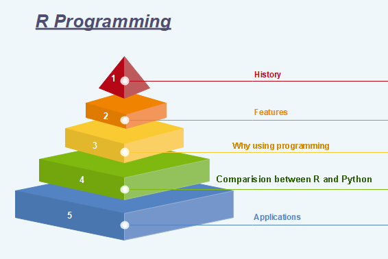
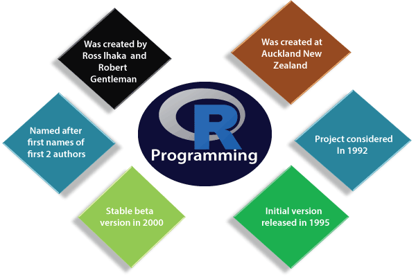

 <!DOCTYPE html><html lang="en"><head><meta http-equiv="Content-Type" content="text/html; charset=utf-8"><title>R Tutorial | Learn R Programming Language Tutorial - javatpoint</title><link rel="SHORTCUT ICON" href="https://static.javatpoint.com/images/favicon2.png" />
<link rel="stylesheet" type="text/css" href="https://static.javatpoint.com/link.css?v=5.5" async /><link rel="dns-prefetch" href="https://clients1.google.com"><link rel="dns-prefetch" href="https://static.javatpoint.com"><link rel="dns-prefetch" href="https://googleads.g.doubleclick.net"><link rel="dns-prefetch" href="https://www.google.com"><link rel="dns-prefetch" href="https://feedify.net"><meta name="theme-color" content="#4CAF50" /><meta property="og:title" content="R Tutorial | Learn R Programming Language Tutorial - javatpoint" /><meta property="og:description" content="Learn R Tutorial with Introduction, Features, Installation, RStudio IDE, R Variables, Datatypes, Keywords, Operators, R If statement, Looping, Repeat, Functions, Factor, Matrices, Exception Handling, Graphics, Animation, Layouts, Statistical Models, Data Handing, Subscripting etc." />
<meta name="keywords" content="r tutorial, programming language, introduction, features, installation, rstudio ide, variables, datatypes, keywords, operators, comments, tokens, r if statement, looping, repeat, while, functions, control statements, recursion, variable scopes, vector, list, string, factor, array, matrices, data frame, exception handling, graphics, animation, layouts, statistical models, data handing, subscripting" /><meta name="description" content="Learn R Tutorial with Introduction, Features, Installation, RStudio IDE, R Variables, Datatypes, Keywords, Operators, R If statement, Looping, Repeat, Functions, Factor, Matrices, Exception Handling, Graphics, Animation, Layouts, Statistical Models, Data Handing, Subscripting etc." /><meta name="viewport" content="width=device-width, initial-scale=1.0"><meta name="apple-mobile-web-app-capable" content="yes"><meta name="apple-mobile-web-app-status-bar-style" content="black"><link rel="canonical" href="https://www.javatpoint.com/r-tutorial" />
<meta property="og:locale" content="en_US" /><meta property="og:type" content="article" /><meta name="twitter:title" property="og:title" content="R Tutorial | Learn R Programming Language Tutorial - javatpoint" /><meta name="twitter:description" property="og:description" content="Learn R Tutorial with Introduction, Features, Installation, RStudio IDE, R Variables, Datatypes, Keywords, Operators, R If statement, Looping, Repeat, Functions, Factor, Matrices, Exception Handling, Graphics, Animation, Layouts, Statistical Models, Data Handing, Subscripting etc." /><meta property="og:url" content="https://www.javatpoint.com/r-tutorial" /><meta property="og:site_name" content="www.javatpoint.com" />
</head>
<body >

 
<table style="width:100%;margin-bottom:5px"> <tr> <td> 
  
 
<gcse:search></gcse:search> 
 </td> </tr></table> 

 
 

 
<gcse:search></gcse:search>

 

 
 

 

 

<table>
<tr><td>

 

 
 

R Programming Tutorial is designed for both beginners and professionals. Our tutorial provides all the basic and advanced concepts of data analysis and visualization.

R is a software environment which is used to analyze statistical information and graphical representation. R allows us to do modular programming using functions. 

Our R tutorial includes all topics of R such as introduction, features, installation, rstudio ide, variables, datatypes, operators, if statement, vector, data handing, graphics, statistical modelling, etc. This programming language was named R, based on the first name letter of the two authors (Robert Gentleman and Ross Ihaka).

<h2 class="h2">What is R Programming</h2>

<strong>"R is an interpreted computer programming language which was created by Ross Ihaka and Robert Gentleman at the University of Auckland, New Zealand."</strong> The <strong><em>R Development Core Team</em></strong> currently develops R. It is also a software environment used to analyze <strong>statistical information</strong>, <strong>graphical representation</strong>, <strong>reporting</strong>, and <strong>data modeling</strong>. R is the implementation of the <strong>S programming</strong> language, which is combined with <strong>lexical scoping semantics</strong>.

R not only allows us to do branching and looping but also allows to do modular programming using functions. R allows integration with the procedures written in the C, C++, .Net, Python, and FORTRAN languages to improve efficiency.

In the present era, R is one of the most important tool which is used by researchers, data analyst, statisticians, and marketers for retrieving, cleaning, analyzing, visualizing, and presenting data.

<h2 class="h2">History of R Programming</h2>

The history of R goes back about 20-30 years ago. R was developed by Ross lhaka and Robert Gentleman in the University of Auckland, New Zealand, and the R Development Core Team currently develops it. This programming language name is taken from the name of both the developers. The first project was considered in 1992. The initial version was released in 1995, and in 2000, a stable beta version was released.

The following table shows the release date, version, and description of R language:

<table class="alt">
<tr>
<th>Version-Release</th>
<th style="width:15%">Date</th>
<th>Description</th>
</tr>
<tr>
<td>0.49</td>
<td>1997-04-23</td>
<td>First time R's source was released, and CRAN (Comprehensive R Archive Network) was started.</td>
</tr>
<tr>
<td>0.60</td>
<td>1997-12-05</td>
<td>R officially gets the GNU license.</td>
</tr>
<tr>
<td>0.65.1</td>
<td>1999-10-07</td>
<td>update.packages and install.packages both are included.</td>
</tr>
<tr>
<td>1.0</td>
<td>2000-02-29</td>
<td>The first production-ready version was released.</td>
</tr>
<tr>
<td>1.4</td>
<td>2001-12-19</td>
<td>First version for Mac OS is made available.</td>
<tr>
<tr>
<td>2.0</td>
<td>2004-10-04</td>
<td>The first version for Mac OS is made available.</td>
</tr>
<tr>
<td>2.1</td>
<td>2005-04-18</td>
<td>Add support for UTF-8encoding, internationalization, localization etc.</td>
</tr>
<tr>
<td>2.11</td>
<td>2010-04-22</td>
<td>Add support for Windows 64-bit systems.</td>
</tr>
<tr>
<td>2.13</td>
<td>2011-04-14</td>
<td>Added a function that rapidly converts code to byte code.</td>
</tr>
<tr>
<td>2.14</td>
<td>2011-10-31</td>
<td>Added some new packages.</td>
</tr>
<tr>
<td>2.15</td>
<td>2012-03-30</td>
<td>Improved serialization speed for long vectors.</td>
</tr>
<tr>
<td>3.0</td>
<td>2013-04-03</td>
<td>Support for larger numeric values on 64-bit systems.</td>
</tr>
<tr>
<td>3.4</td>
<td>2017-04-21</td>
<td>The just-in-time compilation (JIT) is enabled by default.</td>
</tr>
<tr>
<td>3.5</td>
<td>2018-04-23</td>
<td>Added new features such as compact internal representation of integer sequences, serialization format etc.</td>
</tr>
</table>
<h2 class="h2">Features of R programming</h2>

R is a domain-specific programming language which aims to do data analysis. It has some unique features which make it very powerful. The most important arguably being the notation of vectors. These vectors allow us to perform a complex operation on a set of values in a single command. There are the following features of R programming:

<ol class="points">
<li>It is a simple and effective programming language which has been well developed.</li>
<li>It is data analysis software.</li>
<li>It is a well-designed, easy, and effective language which has the concepts of user-defined, looping, conditional, and various I/O facilities.</li>
<li>It has a consistent and incorporated set of tools which are used for data analysis. </li>
<li>For different types of calculation on arrays, lists and vectors, R contains a suite of operators.</li>
<li>It provides effective data handling and storage facility. </li>
<li>It is an open-source, powerful, and highly extensible software.</li>
<li>It provides highly extensible graphical techniques. </li>
<li>It allows us to perform multiple calculations using vectors.</li>
<li>R is an interpreted language.</li>
</ol>
<h2 class="h2">Why use R Programming?</h2>

There are several tools available in the market to perform data analysis. Learning new languages is time taken. The data scientist can use two excellent tools, i.e., R and Python. We may not have time to learn them both at the time when we get started to learn data science. Learning statistical modeling and algorithm is more important than to learn a programming language. A programming language is used to compute and communicate our discovery.

The important task in data science is the way we deal with the data: clean, feature engineering, feature selection, and import. It should be our primary focus. Data scientist job is to understand the data, manipulate it, and expose the best approach. For machine learning, the best algorithms can be implemented with R. <strong>Keras</strong> and <strong>TensorFlow</strong> allow us to create high-end machine learning techniques. R has a package to perform <strong>Xgboost</strong>. Xgboost is one of the best algorithms for <strong>Kaggle competition</strong>. 

R communicate with the other languages and possibly calls Python, Java, C++. The big data world is also accessible to R. We can connect R with different databases like <strong>Spark</strong> or <strong>Hadoop</strong>.

In brief, R is a great tool to investigate and explore the data. The elaborate analysis such as clustering, correlation, and data reduction are done with R.

<h2 class="h2">Comparison between R and Python</h2>

Data science deals with identifying, extracting, and representing meaningful information from the data source. R, Python, SAS, SQL, Tableau, MATLAB, etc. are the most useful tools for data science. R and Python are the most used ones. But still, it becomes confusing to choose the better or the most suitable one among the two, R and Python.

<table class="alt">
<tr>
<th>Comparison Index</th>
<th>R</th>
<th>Python</th>
</tr>
<tr>
<td><strong>Overview</strong></td>
<td>"R is an interpreted computer programming language which was created by Ross Ihaka and Robert Gentleman at the University of Auckland, New Zealand ." The R Development Core Team currently develops R. R is also a software environment which is used to analyze statistical information, graphical representation, reporting, and data modeling.</td>
<td>Python is an Interpreted high-level programming language used for general-purpose programming. Guido Van Rossum created it, and it was first released in 1991. Python has a very simple and clean code syntax. It emphasizes the code readability and debugging is also simple and easier in Python.</td>
</tr>
<tr>
<td><strong>Specialties for data science</strong></td>
<td>R packages have advanced techniques which are very useful for statistical work. The CRAN text view is provided by many useful R packages. These packages cover everything from Psychometrics to Genetics to Finance.</td>
<td>For finding outliers in a data set both R and Python are equally good. But for developing a web service to allow peoples to upload datasets and find outliers, Python is better.</td>
</tr>
<tr>
<td><strong>Functionalities</strong></td>
<td>For data analysis, R has inbuilt functionalities</td>
<td>Most of the data analysis functionalities are not inbuilt. They are available through packages like Numpy and Pandas</td>
</tr>
<tr>
<td><strong>Key domains of application</strong></td>
<td>Data visualization is a key aspect of analysis. R packages such as ggplot2, ggvis, lattice, etc. make data visualization easier.</td>
<td>Python is better for deep learning because Python packages such as Caffe, Keras, OpenNN, etc. allows the development of the deep neural network in a very simple way.</td>
</tr>
<tr>
<td><strong>Availability of packages</strong></td>
<td>There are hundreds of packages and ways to accomplish needful data science tasks.</td>
<td>Python has few main packages such as viz, Sccikit learn, and Pandas for data analysis of machine learning, respectively.</td>
</tr>
</table>
<h2 class="h2">Applications of R</h2>

There are several-applications available in real-time. Some of the popular applications are as follows:

<ul class="points">
<li>Facebook</li>
<li>Google</li>
<li>Twitter</li>
<li>HRDAG</li>
<li>Sunlight Foundation</li>
<li>RealClimate</li>
<li>NDAA</li>
<li>XBOX ONE</li>
<li>ANZ</li>
<li>FDA</li>
</ul>
<h2 class="h2">Prerequisite</h2>

R programming is used for statistical information and data representation. So it is required that we should have the knowledge of statistical theory in mathematics. Understanding of different types of graphs for data representation and most important is that we should have prior knowledge of any programming.

<h2 class="h2">Audience</h2>

This tutorial is helpful for those students who are interested in gaining the knowledge of how data analysis projects are implemented. This tutorial covers all the basics of R and how data analysis is done using R.

<h2 class="h2">Problems</h2>

We assure you that you will not find any problem with this R Programming Tutorial. But if there is any mistake, please post the problem in the contact form.

 

  

 

  
</td></tr>
</table>

 

 
 

 

 
  

 
 

 
</body> </html> 