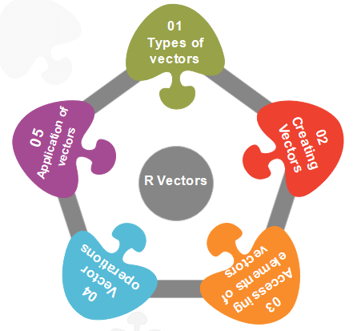
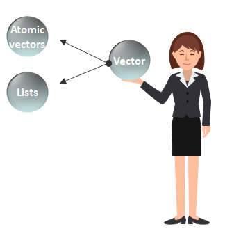
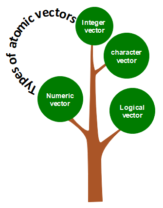
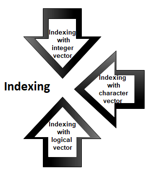
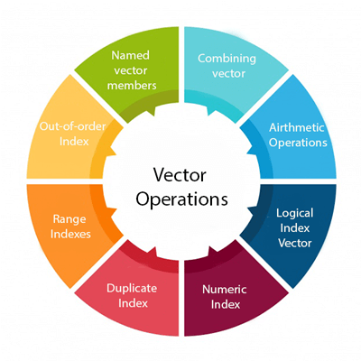

<table>
<tbody><tr><td>

<a class="next" href="r-lists">next →</a>
<a class="next" href="r-built-in-functions">← prev</a>

<h1 class="h1">R Vector</h1>

A <strong>vector</strong> is a basic data structure which plays an important role in R programming. 

In R, a sequence of elements which share the same data type is known as vector. A vector supports logical, integer, double, character, complex, or raw data type. The elements which are contained in vector known as <strong>components</strong> of the vector. We can check the type of vector with the help of the <strong>typeof()</strong> function. 

The length is an important property of a vector. A vector length is basically the number of elements in the vector, and it is calculated with the help of the length() function.

Vector is classified into two parts, i.e., <strong>Atomic vectors</strong> and <strong>Lists</strong>. They have three common properties, i.e., <strong>function type, function length</strong>, and <strong>attribute function</strong>. 
 table:eq(0) > tbody:eq(0) > tr:eq(0) > td:eq(0) > p:eq(3)" data-section-id="" data-ap-network="custom" style="display: block; clear: both; text-align: center; margin: 10px auto; width: 535px; height: 300px; overflow: hidden;"><!--  AP instream video tag Desktop -->

<video id="ap-player_html5_api" class="vjs-tech" playsinline="playsinline" preload="auto" tabindex="-1" muted="muted" src="blob:https://www.javatpoint.com/a058cba7-ee6c-4577-a39e-713e71a49366"></video>

Video Player is loading.

<button class="vjs-play-control vjs-control vjs-button" type="button" title="Play" aria-disabled="false" style="height: 15px; width: 40px;">Play</button><button class="vjs-control vjs-button vjs-next-control" type="button" aria-disabled="false" title="Next" style="height: 15px; width: 40px;">Next</button>
<button class="vjs-mute-control vjs-control vjs-button vjs-vol-0" type="button" title="Unmute" aria-disabled="false" style="height: 15px; width: 40px;">Unmute</button>

Current TimeÂ&nbsp;0:00

/

DurationÂ&nbsp;18:10

Loaded: 0.37%

00:00

Stream TypeÂ&nbsp;LIVE

<button class="vjs-seek-to-live-control vjs-control" type="button" title="Seek to live, currently behind live" aria-disabled="false">Seek to live, currently behind liveLIVE</button>
Remaining TimeÂ&nbsp;-18:10

Â&nbsp;

1x
<button class="vjs-playback-rate vjs-menu-button vjs-menu-button-popup vjs-button" type="button" aria-disabled="false" title="Playback Rate" aria-haspopup="true" aria-expanded="false" aria-describedby="vjs-playback-rate-value-label-ap-player_component_310">Playback Rate</button>
<ul class="vjs-menu-content"></ul>

<button class="vjs-chapters-button vjs-menu-button vjs-menu-button-popup vjs-button" type="button" aria-disabled="false" title="Chapters" aria-haspopup="true" aria-expanded="false">Chapters</button>
<ul class="vjs-menu-content"><li class="vjs-menu-title" tabindex="-1">Chapters</li></ul>

<button class="vjs-descriptions-button vjs-menu-button vjs-menu-button-popup vjs-button" type="button" aria-disabled="false" title="Descriptions" aria-haspopup="true" aria-expanded="false">Descriptions</button>
<ul class="vjs-menu-content"><li class="vjs-menu-item vjs-selected" tabindex="-1" role="menuitemradio" aria-disabled="false" aria-checked="true">descriptions off, selected</li></ul>

<button class="vjs-subs-caps-button vjs-menu-button vjs-menu-button-popup vjs-button" type="button" aria-disabled="false" title="Captions" aria-haspopup="true" aria-expanded="false">Captions</button>
<ul class="vjs-menu-content"><li class="vjs-menu-item vjs-texttrack-settings" tabindex="-1" role="menuitem" aria-disabled="false">captions settings, opens captions settings dialog</li><li class="vjs-menu-item vjs-selected" tabindex="-1" role="menuitemradio" aria-disabled="false" aria-checked="true">captions off, selected</li></ul>

<button class="vjs-audio-button vjs-menu-button vjs-menu-button-popup vjs-button" type="button" aria-disabled="false" title="Audio Track" aria-haspopup="true" aria-expanded="false">Audio Track</button>
<ul class="vjs-menu-content"><li class="vjs-menu-item vjs-selected vjs-main-menu-item" tabindex="-1" role="menuitemradio" aria-disabled="false" aria-checked="true">English, selected</li></ul>

<button class="vjs-fullscreen-control vjs-control vjs-button" type="button" title="Fullscreen" aria-disabled="false" style="height: 15px; width: 40px;">Fullscreen</button>

This is a modal window.

Beginning of dialog window. Escape will cancel and close the window.

<fieldset class="vjs-fg-color vjs-track-setting"><legend id="captions-text-legend-ap-player_component_520">Text</legend><label id="captions-foreground-color-ap-player_component_520" class="vjs-label">Color</label><select aria-labelledby="captions-text-legend-ap-player_component_520 captions-foreground-color-ap-player_component_520"><option id="captions-foreground-color-ap-player_component_520-White" value="#FFF" aria-labelledby="captions-text-legend-ap-player_component_520 captions-foreground-color-ap-player_component_520 captions-foreground-color-ap-player_component_520-White">White</option><option id="captions-foreground-color-ap-player_component_520-Black" value="#000" aria-labelledby="captions-text-legend-ap-player_component_520 captions-foreground-color-ap-player_component_520 captions-foreground-color-ap-player_component_520-Black">Black</option><option id="captions-foreground-color-ap-player_component_520-Red" value="#F00" aria-labelledby="captions-text-legend-ap-player_component_520 captions-foreground-color-ap-player_component_520 captions-foreground-color-ap-player_component_520-Red">Red</option><option id="captions-foreground-color-ap-player_component_520-Green" value="#0F0" aria-labelledby="captions-text-legend-ap-player_component_520 captions-foreground-color-ap-player_component_520 captions-foreground-color-ap-player_component_520-Green">Green</option><option id="captions-foreground-color-ap-player_component_520-Blue" value="#00F" aria-labelledby="captions-text-legend-ap-player_component_520 captions-foreground-color-ap-player_component_520 captions-foreground-color-ap-player_component_520-Blue">Blue</option><option id="captions-foreground-color-ap-player_component_520-Yellow" value="#FF0" aria-labelledby="captions-text-legend-ap-player_component_520 captions-foreground-color-ap-player_component_520 captions-foreground-color-ap-player_component_520-Yellow">Yellow</option><option id="captions-foreground-color-ap-player_component_520-Magenta" value="#F0F" aria-labelledby="captions-text-legend-ap-player_component_520 captions-foreground-color-ap-player_component_520 captions-foreground-color-ap-player_component_520-Magenta">Magenta</option><option id="captions-foreground-color-ap-player_component_520-Cyan" value="#0FF" aria-labelledby="captions-text-legend-ap-player_component_520 captions-foreground-color-ap-player_component_520 captions-foreground-color-ap-player_component_520-Cyan">Cyan</option></select><label id="captions-foreground-opacity-ap-player_component_520" class="vjs-label">Transparency</label><select aria-labelledby="captions-text-legend-ap-player_component_520 captions-foreground-opacity-ap-player_component_520"><option id="captions-foreground-opacity-ap-player_component_520-Opaque" value="1" aria-labelledby="captions-text-legend-ap-player_component_520 captions-foreground-opacity-ap-player_component_520 captions-foreground-opacity-ap-player_component_520-Opaque">Opaque</option><option id="captions-foreground-opacity-ap-player_component_520-SemiTransparent" value="0.5" aria-labelledby="captions-text-legend-ap-player_component_520 captions-foreground-opacity-ap-player_component_520 captions-foreground-opacity-ap-player_component_520-SemiTransparent">Semi-Transparent</option></select></fieldset><fieldset class="vjs-bg-color vjs-track-setting"><legend id="captions-background-ap-player_component_520">Background</legend><label id="captions-background-color-ap-player_component_520" class="vjs-label">Color</label><select aria-labelledby="captions-background-ap-player_component_520 captions-background-color-ap-player_component_520"><option id="captions-background-color-ap-player_component_520-Black" value="#000" aria-labelledby="captions-background-ap-player_component_520 captions-background-color-ap-player_component_520 captions-background-color-ap-player_component_520-Black">Black</option><option id="captions-background-color-ap-player_component_520-White" value="#FFF" aria-labelledby="captions-background-ap-player_component_520 captions-background-color-ap-player_component_520 captions-background-color-ap-player_component_520-White">White</option><option id="captions-background-color-ap-player_component_520-Red" value="#F00" aria-labelledby="captions-background-ap-player_component_520 captions-background-color-ap-player_component_520 captions-background-color-ap-player_component_520-Red">Red</option><option id="captions-background-color-ap-player_component_520-Green" value="#0F0" aria-labelledby="captions-background-ap-player_component_520 captions-background-color-ap-player_component_520 captions-background-color-ap-player_component_520-Green">Green</option><option id="captions-background-color-ap-player_component_520-Blue" value="#00F" aria-labelledby="captions-background-ap-player_component_520 captions-background-color-ap-player_component_520 captions-background-color-ap-player_component_520-Blue">Blue</option><option id="captions-background-color-ap-player_component_520-Yellow" value="#FF0" aria-labelledby="captions-background-ap-player_component_520 captions-background-color-ap-player_component_520 captions-background-color-ap-player_component_520-Yellow">Yellow</option><option id="captions-background-color-ap-player_component_520-Magenta" value="#F0F" aria-labelledby="captions-background-ap-player_component_520 captions-background-color-ap-player_component_520 captions-background-color-ap-player_component_520-Magenta">Magenta</option><option id="captions-background-color-ap-player_component_520-Cyan" value="#0FF" aria-labelledby="captions-background-ap-player_component_520 captions-background-color-ap-player_component_520 captions-background-color-ap-player_component_520-Cyan">Cyan</option></select><label id="captions-background-opacity-ap-player_component_520" class="vjs-label">Transparency</label><select aria-labelledby="captions-background-ap-player_component_520 captions-background-opacity-ap-player_component_520"><option id="captions-background-opacity-ap-player_component_520-Opaque" value="1" aria-labelledby="captions-background-ap-player_component_520 captions-background-opacity-ap-player_component_520 captions-background-opacity-ap-player_component_520-Opaque">Opaque</option><option id="captions-background-opacity-ap-player_component_520-SemiTransparent" value="0.5" aria-labelledby="captions-background-ap-player_component_520 captions-background-opacity-ap-player_component_520 captions-background-opacity-ap-player_component_520-SemiTransparent">Semi-Transparent</option><option id="captions-background-opacity-ap-player_component_520-Transparent" value="0" aria-labelledby="captions-background-ap-player_component_520 captions-background-opacity-ap-player_component_520 captions-background-opacity-ap-player_component_520-Transparent">Transparent</option></select></fieldset><fieldset class="vjs-window-color vjs-track-setting"><legend id="captions-window-ap-player_component_520">Window</legend><label id="captions-window-color-ap-player_component_520" class="vjs-label">Color</label><select aria-labelledby="captions-window-ap-player_component_520 captions-window-color-ap-player_component_520"><option id="captions-window-color-ap-player_component_520-Black" value="#000" aria-labelledby="captions-window-ap-player_component_520 captions-window-color-ap-player_component_520 captions-window-color-ap-player_component_520-Black">Black</option><option id="captions-window-color-ap-player_component_520-White" value="#FFF" aria-labelledby="captions-window-ap-player_component_520 captions-window-color-ap-player_component_520 captions-window-color-ap-player_component_520-White">White</option><option id="captions-window-color-ap-player_component_520-Red" value="#F00" aria-labelledby="captions-window-ap-player_component_520 captions-window-color-ap-player_component_520 captions-window-color-ap-player_component_520-Red">Red</option><option id="captions-window-color-ap-player_component_520-Green" value="#0F0" aria-labelledby="captions-window-ap-player_component_520 captions-window-color-ap-player_component_520 captions-window-color-ap-player_component_520-Green">Green</option><option id="captions-window-color-ap-player_component_520-Blue" value="#00F" aria-labelledby="captions-window-ap-player_component_520 captions-window-color-ap-player_component_520 captions-window-color-ap-player_component_520-Blue">Blue</option><option id="captions-window-color-ap-player_component_520-Yellow" value="#FF0" aria-labelledby="captions-window-ap-player_component_520 captions-window-color-ap-player_component_520 captions-window-color-ap-player_component_520-Yellow">Yellow</option><option id="captions-window-color-ap-player_component_520-Magenta" value="#F0F" aria-labelledby="captions-window-ap-player_component_520 captions-window-color-ap-player_component_520 captions-window-color-ap-player_component_520-Magenta">Magenta</option><option id="captions-window-color-ap-player_component_520-Cyan" value="#0FF" aria-labelledby="captions-window-ap-player_component_520 captions-window-color-ap-player_component_520 captions-window-color-ap-player_component_520-Cyan">Cyan</option></select><label id="captions-window-opacity-ap-player_component_520" class="vjs-label">Transparency</label><select aria-labelledby="captions-window-ap-player_component_520 captions-window-opacity-ap-player_component_520"><option id="captions-window-opacity-ap-player_component_520-Transparent" value="0" aria-labelledby="captions-window-ap-player_component_520 captions-window-opacity-ap-player_component_520 captions-window-opacity-ap-player_component_520-Transparent">Transparent</option><option id="captions-window-opacity-ap-player_component_520-SemiTransparent" value="0.5" aria-labelledby="captions-window-ap-player_component_520 captions-window-opacity-ap-player_component_520 captions-window-opacity-ap-player_component_520-SemiTransparent">Semi-Transparent</option><option id="captions-window-opacity-ap-player_component_520-Opaque" value="1" aria-labelledby="captions-window-ap-player_component_520 captions-window-opacity-ap-player_component_520 captions-window-opacity-ap-player_component_520-Opaque">Opaque</option></select></fieldset>

<fieldset class="vjs-font-percent vjs-track-setting"><legend id="captions-font-size-ap-player_component_520" class="">Font Size</legend><select aria-labelledby="captions-font-size-ap-player_component_520"><option id="captions-font-size-ap-player_component_520-50" value="0.50" aria-labelledby="captions-font-size-ap-player_component_520 captions-font-size-ap-player_component_520-50">50%</option><option id="captions-font-size-ap-player_component_520-75" value="0.75" aria-labelledby="captions-font-size-ap-player_component_520 captions-font-size-ap-player_component_520-75">75%</option><option id="captions-font-size-ap-player_component_520-100" value="1.00" aria-labelledby="captions-font-size-ap-player_component_520 captions-font-size-ap-player_component_520-100">100%</option><option id="captions-font-size-ap-player_component_520-125" value="1.25" aria-labelledby="captions-font-size-ap-player_component_520 captions-font-size-ap-player_component_520-125">125%</option><option id="captions-font-size-ap-player_component_520-150" value="1.50" aria-labelledby="captions-font-size-ap-player_component_520 captions-font-size-ap-player_component_520-150">150%</option><option id="captions-font-size-ap-player_component_520-175" value="1.75" aria-labelledby="captions-font-size-ap-player_component_520 captions-font-size-ap-player_component_520-175">175%</option><option id="captions-font-size-ap-player_component_520-200" value="2.00" aria-labelledby="captions-font-size-ap-player_component_520 captions-font-size-ap-player_component_520-200">200%</option><option id="captions-font-size-ap-player_component_520-300" value="3.00" aria-labelledby="captions-font-size-ap-player_component_520 captions-font-size-ap-player_component_520-300">300%</option><option id="captions-font-size-ap-player_component_520-400" value="4.00" aria-labelledby="captions-font-size-ap-player_component_520 captions-font-size-ap-player_component_520-400">400%</option></select></fieldset><fieldset class="vjs-edge-style vjs-track-setting"><legend id="ap-player_component_520" class="">Text Edge Style</legend><select aria-labelledby="ap-player_component_520"><option id="ap-player_component_520-None" value="none" aria-labelledby="ap-player_component_520 ap-player_component_520-None">None</option><option id="ap-player_component_520-Raised" value="raised" aria-labelledby="ap-player_component_520 ap-player_component_520-Raised">Raised</option><option id="ap-player_component_520-Depressed" value="depressed" aria-labelledby="ap-player_component_520 ap-player_component_520-Depressed">Depressed</option><option id="ap-player_component_520-Uniform" value="uniform" aria-labelledby="ap-player_component_520 ap-player_component_520-Uniform">Uniform</option><option id="ap-player_component_520-Dropshadow" value="dropshadow" aria-labelledby="ap-player_component_520 ap-player_component_520-Dropshadow">Dropshadow</option></select></fieldset><fieldset class="vjs-font-family vjs-track-setting"><legend id="captions-font-family-ap-player_component_520" class="">Font Family</legend><select aria-labelledby="captions-font-family-ap-player_component_520"><option id="captions-font-family-ap-player_component_520-ProportionalSansSerif" value="proportionalSansSerif" aria-labelledby="captions-font-family-ap-player_component_520 captions-font-family-ap-player_component_520-ProportionalSansSerif">Proportional Sans-Serif</option><option id="captions-font-family-ap-player_component_520-MonospaceSansSerif" value="monospaceSansSerif" aria-labelledby="captions-font-family-ap-player_component_520 captions-font-family-ap-player_component_520-MonospaceSansSerif">Monospace Sans-Serif</option><option id="captions-font-family-ap-player_component_520-ProportionalSerif" value="proportionalSerif" aria-labelledby="captions-font-family-ap-player_component_520 captions-font-family-ap-player_component_520-ProportionalSerif">Proportional Serif</option><option id="captions-font-family-ap-player_component_520-MonospaceSerif" value="monospaceSerif" aria-labelledby="captions-font-family-ap-player_component_520 captions-font-family-ap-player_component_520-MonospaceSerif">Monospace Serif</option><option id="captions-font-family-ap-player_component_520-Casual" value="casual" aria-labelledby="captions-font-family-ap-player_component_520 captions-font-family-ap-player_component_520-Casual">Casual</option><option id="captions-font-family-ap-player_component_520-Script" value="script" aria-labelledby="captions-font-family-ap-player_component_520 captions-font-family-ap-player_component_520-Script">Script</option><option id="captions-font-family-ap-player_component_520-SmallCaps" value="small-caps" aria-labelledby="captions-font-family-ap-player_component_520 captions-font-family-ap-player_component_520-SmallCaps">Small Caps</option></select></fieldset>

<button type="button" class="vjs-default-button" title="restore all settings to the default values">Reset restore all settings to the default values</button><button type="button" class="vjs-done-button">Done</button>

<button class="vjs-close-button vjs-control vjs-button" type="button" title="Close Modal Dialog" aria-disabled="false">Close Modal Dialog</button>
End of dialog window.

<button class="vjs-control vjs-button vjs-backward-skip-control" type="button" aria-disabled="false" title="Backward Skip 10s" style="height: calc(37.5px) !important;">Backward Skip 10s</button><button class="vjs-control vjs-button vjs-big-play-control" type="button" aria-disabled="false" title="Play Video" style="height: calc(66.6667px) !important; margin: 0px calc(41.1538px) !important;">Play Video</button><button class="vjs-control vjs-button vjs-big-pause-control" type="button" aria-disabled="false" title="Pause Video" style="height: calc(66.6667px) !important; margin: 0px calc(41.1538px) !important;">Pause Video</button><button class="vjs-control vjs-button vjs-forward-skip-control" type="button" aria-disabled="false" title="Forward Skip 10s" style="height: calc(37.5px) !important;">Forward Skip 10s</button>

<video title="Advertisement" webkit-playsinline="true" playsinline="true" style="background-color: rgb(0, 0, 0); position: absolute; width: 100%; height: 100%; left: 0px; top: 0px;"></video>

<video title="Advertisement" webkit-playsinline="true" playsinline="true" style="background-color: rgb(0, 0, 0); position: absolute; width: 100%; height: 100%; left: 0px; top: 0px;"></video>

<iframe src="https://imasdk.googleapis.com/js/core/bridge3.581.0_en.html#goog_989268937" allowfullscreen="" allow="autoplay" id="goog_989268937" data-gtm-yt-inspected-6="true" data-gtm-yt-inspected-15="true" style="border: 0px; opacity: 0; margin: 0px; padding: 0px; position: relative; color-scheme: light;"></iframe><iframe sandbox="allow-scripts allow-same-origin" data-gtm-yt-inspected-6="true" data-gtm-yt-inspected-15="true" style="display: none;"></iframe>

<svg xmlns="http://www.w3.org/2000/svg" fill="none" viewBox="0 0 24 24" stroke-width="1.5" stroke="currentColor" class="w-6 h-6" style="color: rgb(36, 31, 44); background: rgb(221, 221, 221); border-radius: 99999px; width: 20px !important;">
    <path stroke-linecap="round" stroke-linejoin="round" d="M9.75 9.75l4.5 4.5m0-4.5l-4.5 4.5M21 12a9 9 0 11-18 0 9 9 0 0118 0z"></path>
  </svg>
  

<iframe frameborder="0" src="https://36861f8fe9387d61b45af9d5d381e765.safeframe.googlesyndication.com/safeframe/1-0-40/html/container.html" id="google_ads_iframe_/103512698,22511567001/22956341697_0" title="3rd party ad content" name="" scrolling="no" marginwidth="0" marginheight="0" width="468" height="280" data-is-safeframe="true" sandbox="allow-forms allow-popups allow-popups-to-escape-sandbox allow-same-origin allow-scripts allow-top-navigation-by-user-activation" role="region" aria-label="Advertisement" tabindex="0" data-google-container-id="t" style="border: 0px; vertical-align: bottom;" data-gtm-yt-inspected-6="true" data-gtm-yt-inspected-15="true" data-load-complete="true"></iframe>

There is only one difference between atomic vectors and lists. In an atomic vector, all the elements are of the same type, but in the list, the elements are of different data types. In this section, we will discuss only the atomic vectors. We will discuss lists briefly in the next topic.

<h2 class="h2">How to create a vector in R?</h2>

In R, we use c() function to create a vector. This function returns a one-dimensional array or simply vector. The c() function is a generic function which combines its argument. All arguments are restricted with a common data type which is the type of the returned value. There are various other ways to create a vector in R, which are as follows:

<h3 class="h3">1) Using the colon(:) operator</h3>

We can create a vector with the help of the colon operator. There is the following syntax to use colon operator:

<ol start="1" class="dp-xml"><li class="alt">z&lt;-x:y&nbsp;&nbsp;&nbsp;</li></ol>
<textarea name="code" class="html" style="display: none;">z&lt;-x:y 
</textarea>

This operator creates a vector with elements from x to y and assigns it to z.

<strong>Example:</strong>

<ol start="1" class="dp-xml"><li class="alt">a&lt;-4:-10&nbsp;&nbsp;</li><li class="">a&nbsp;&nbsp;</li></ol>
<textarea name="code" class="html" style="display: none;">a&lt;-4:-10
a
</textarea>

<strong>Output</strong>

<pre>[1]   4   3   2   1   0   -1   -2   -3   -4   -5   -6   -7   -8   -9   -10
</pre>

<h3 class="h3">2) Using the seq() function</h3>

In R, we can create a vector with the help of the seq() function. A sequence function creates a sequence of elements as a vector. The seq() function is used in two ways, i.e., by setting step size with ?by' parameter or specifying the length of the vector with the 'length.out' feature. 

<strong>Example:</strong>
 table:eq(0) > tbody:eq(0) > tr:eq(0) > td:eq(0) > p:eq(11)" data-section-id="" data-ap-network="adpTags" data-render-time="1689710549343" style="display: block; clear: both; text-align: center; margin: 10px auto 20px; width: 0px; height: 0px; overflow: hidden;">

<ol start="1" class="dp-xml"><li class="alt">seq_vec&lt;-seq(1,4,by=0.5)&nbsp;&nbsp;</li><li class="">seq_vec&nbsp;&nbsp;</li><li class="alt">class(seq_vec)&nbsp;&nbsp;</li></ol>
<textarea name="code" class="html" style="display: none;">seq_vec&lt;-seq(1,4,by=0.5)
seq_vec
class(seq_vec)
</textarea>

<strong>Output</strong>

<pre>[1]   1.0   1.5   2.0   2.5   3.0   3.5   4.0
</pre>

<strong>Example:</strong>

<ol start="1" class="dp-xml"><li class="alt">seq_vec&lt;-seq(1,4,length.out=6)&nbsp;&nbsp;</li><li class="">seq_vec&nbsp;&nbsp;</li><li class="alt">class(seq_vec)&nbsp;&nbsp;</li></ol>
<textarea name="code" class="html" style="display: none;">seq_vec&lt;-seq(1,4,length.out=6)
seq_vec
class(seq_vec)
</textarea>

<strong>Output</strong>

<pre>[1]   1.0   1.6   2.2   2.8   3.4   4.0
[1]   "numeric"
</pre>

<h2 class="h2">Atomic vectors in R</h2>

In R, there are four types of atomic vectors. Atomic vectors play an important role in Data Science. Atomic vectors are created with the help of <strong>c()</strong> function. These atomic vectors are as follows:

<h3 class="h3">Numeric vector</h3>

The decimal values are known as numeric data types in R. If we assign a decimal value to any variable d, then this d variable will become a numeric type. A vector which contains numeric elements is known as a numeric vector. 
 table:eq(0) > tbody:eq(0) > tr:eq(0) > td:eq(0) > p:eq(16)" data-section-id="" data-ap-network="adpTags" data-render-time="1689710549369" style="display: block; clear: both; text-align: center; margin: 10px auto 50px; width: 0px; height: 0px; overflow: hidden;">

<strong>Example:</strong>

<ol start="1" class="dp-xml"><li class="alt">d&lt;-45.5&nbsp;&nbsp;</li><li class="">num_vec&lt;-c(10.1,&nbsp;10.2,&nbsp;33.2)&nbsp;&nbsp;</li><li class="alt">d&nbsp;&nbsp;</li><li class="">num_vec&nbsp;&nbsp;</li><li class="alt">class(d)&nbsp;&nbsp;</li><li class="">class(num_vec)&nbsp;&nbsp;</li></ol>
<textarea name="code" class="html" style="display: none;">d&lt;-45.5
num_vec&lt;-c(10.1, 10.2, 33.2)
d
num_vec
class(d)
class(num_vec)
</textarea>

<strong>Output</strong>

<pre>[1]   45.5
[1]   10.1   10.2   33.2
[1]   "numeric"
[1]   "numeric"
</pre>

<h3 class="h3">Integer vector</h3>

A non-fraction numeric value is known as integer data. This integer data is represented by "Int." The Int size is 2 bytes and long Int size of 4 bytes. There is two way to assign an integer value to a variable, i.e., by using as.integer() function and appending of L to the value.
 table:eq(0) > tbody:eq(0) > tr:eq(0) > td:eq(0) > p:eq(19)" data-section-id="" data-ap-network="adpTags" data-render-time="1689710549324" style="display: block; clear: both; text-align: center; margin: 10px auto; width: 0px; height: 0px; overflow: hidden;">

A vector which contains integer elements is known as an integer vector.

<strong>Example:</strong>

<ol start="1" class="dp-xml"><li class="alt">d&lt;-as.integer(5)&nbsp;&nbsp;</li><li class="">e&lt;-5L&nbsp;&nbsp;</li><li class="alt">int_vec&lt;-c(1,2,3,4,5)&nbsp;&nbsp;</li><li class="">int_vec&lt;-as.integer(int_vec)&nbsp;&nbsp;</li><li class="alt">int_vec1&lt;-c(1L,2L,3L,4L,5L)&nbsp;&nbsp;</li><li class="">class(d)&nbsp;&nbsp;</li><li class="alt">class(e)&nbsp;&nbsp;</li><li class="">class(int_vec)&nbsp;&nbsp;</li><li class="alt">class(int_vec1)&nbsp;&nbsp;</li></ol>
<textarea name="code" class="html" style="display: none;">d&lt;-as.integer(5)
e&lt;-5L
int_vec&lt;-c(1,2,3,4,5)
int_vec&lt;-as.integer(int_vec)
int_vec1&lt;-c(1L,2L,3L,4L,5L)
class(d)
class(e)
class(int_vec)
class(int_vec1)
</textarea>

<strong>Output</strong>

<pre>[1]   "integer"
[1]   "integer"
[1]   "integer"
[1]   "integer"
</pre>

<h3 class="h3">Character vector</h3>

A character is held as a one-byte integer in memory. In R, there are two different ways to create a character data type value, i.e., using as.character() function and by typing string between double quotes("") or single quotes('').

A vector which contains character elements is known as an integer vector. 

<strong>Example:</strong>

<ol start="1" class="dp-xml"><li class="alt">d&lt;-'shubham'&nbsp;&nbsp;</li><li class="">e&lt;-"Arpita"&nbsp;&nbsp;</li><li class="alt">f&lt;-65&nbsp;&nbsp;</li><li class="">f&lt;-as.character(f)&nbsp;&nbsp;</li><li class="alt">d&nbsp;&nbsp;</li><li class="">e&nbsp;&nbsp;</li><li class="alt">f&nbsp;&nbsp;</li><li class="">char_vec&lt;-c(1,2,3,4,5)&nbsp;&nbsp;</li><li class="alt">char_vec&lt;-as.character(char_vec)&nbsp;&nbsp;</li><li class="">char_vec1&lt;-c("shubham","arpita","nishka","vaishali")&nbsp;&nbsp;</li><li class="alt">char_vec&nbsp;&nbsp;</li><li class="">class(d)&nbsp;&nbsp;</li><li class="alt">class(e)&nbsp;&nbsp;</li><li class="">class(f)&nbsp;&nbsp;</li><li class="alt">class(char_vec)&nbsp;&nbsp;</li><li class="">class(char_vec1)&nbsp;&nbsp;</li></ol>
<textarea name="code" class="html" style="display: none;">d&lt;-'shubham'
e&lt;-"Arpita"
f&lt;-65
f&lt;-as.character(f)
d
e
f
char_vec&lt;-c(1,2,3,4,5)
char_vec&lt;-as.character(char_vec)
char_vec1&lt;-c("shubham","arpita","nishka","vaishali")
char_vec
class(d)
class(e)
class(f)
class(char_vec)
class(char_vec1)
</textarea>

<strong>Output</strong>

<pre>[1]   "shubham"
[1]   "Arpita"
[1]   "65"
[1]   "1"   "2"   "3"   "4"   "5"
[1]   "shubham"   "arpita"   "nishka"   "vaishali"
[1]   "character"
[1]   "character"
[1]   "character"
[1]   "character"
[1]   "character"
</pre>

<h3 class="h3">Logical vector</h3>

The logical data types have only two values i.e., True or False. These values are based on which condition is satisfied. A vector which contains Boolean values is known as the logical vector.

<strong>Example:</strong>
 table:eq(0) > tbody:eq(0) > tr:eq(0) > td:eq(0) > p:eq(28)" data-section-id="" data-ap-network="adpTags" data-render-time="1689710549353" style="display: block; clear: both; text-align: center; margin: 10px auto; width: 0px; height: 0px; overflow: hidden;">

<ol start="1" class="dp-xml"><li class="alt">d&lt;-as.integer(5)&nbsp;&nbsp;</li><li class="">e&lt;-as.integer(6)&nbsp;&nbsp;</li><li class="alt">f&lt;-as.integer(7)&nbsp;&nbsp;</li><li class="">g&lt;-d&gt;e&nbsp;&nbsp;</li><li class="alt">h&lt;-e&lt;f&nbsp;&nbsp;</li><li class="">g&nbsp;&nbsp;</li><li class="alt">h&nbsp;&nbsp;</li><li class="">log_vec&lt;-c(d&lt;e,&nbsp;d&lt;f,&nbsp;e&lt;d,e&lt;f,f&lt;d,f&lt;e)&nbsp;&nbsp;</li><li class="alt">log_vec&nbsp;&nbsp;</li><li class="">class(g)&nbsp;&nbsp;</li><li class="alt">class(h)&nbsp;&nbsp;</li><li class="">class(log_vec)&nbsp;&nbsp;</li></ol>
<textarea name="code" class="html" style="display: none;">d&lt;-as.integer(5)
e&lt;-as.integer(6)
f&lt;-as.integer(7)
g&lt;-d&gt;e
h&lt;-e&lt;f
g
h
log_vec&lt;-c(d&lt;e, d&lt;f, e&lt;d,e&lt;f,f&lt;d,f&lt;e)
log_vec
class(g)
class(h)
class(log_vec)
</textarea>

<strong>Output</strong>

<pre>[1]   FALSE
[1]   TRUE
[1]   TRUE   TRUE   FALSE   TRUE   FALSE   FALSE
[1]   "logical"
[1]   "logical"
[1]   "logical"
</pre>

<h2 class="h2">Accessing elements of vectors</h2>

We can access the elements of a vector with the help of vector indexing. Indexing denotes the position where the value in a vector is stored. Indexing will be performed with the help of integer, character, or logic.

<h3 class="h3">1) Indexing with integer vector</h3>

On integer vector, indexing is performed in the same way as we have applied in C, C++, and java. There is only one difference, i.e., in C, C++, and java the indexing starts from 0, but in R, the indexing starts from 1. Like other programming languages, we perform indexing by specifying an integer value in square braces [] next to our vector.

<strong>Example:</strong>

<ol start="1" class="dp-xml"><li class="alt">seq_vec&lt;-seq(1,4,length.out=6)&nbsp;&nbsp;</li><li class="">seq_vec&nbsp;&nbsp;</li><li class="alt">seq_vec[2]&nbsp;&nbsp;</li></ol>
<textarea name="code" class="html" style="display: none;">seq_vec&lt;-seq(1,4,length.out=6)
seq_vec
seq_vec[2]
</textarea>

<strong>Output</strong>
 table:eq(0) > tbody:eq(0) > tr:eq(0) > td:eq(0) > p:eq(33)" data-section-id="" data-ap-network="adpTags" data-render-time="1689710549334" style="display: block; clear: both; text-align: center; margin: 10px auto; width: 0px; height: 0px; overflow: hidden;">

<pre>[1] 1.0 1.6 2.2 2.8 3.4 4.0
[1] 1.6
</pre>

<h3 class="h3">2) Indexing with a character vector</h3>

In character vector indexing, we assign a unique key to each element of the vector. These keys are uniquely defined as each element and can be accessed very easily. Let's see an example to understand how it is performed.

<strong>Example:</strong>

<ol start="1" class="dp-xml"><li class="alt">char_vec&lt;-c("shubham"=22,"arpita"=23,"vaishali"=25)&nbsp;&nbsp;</li><li class="">char_vec&nbsp;&nbsp;</li><li class="alt">char_vec["arpita"]&nbsp;&nbsp;</li></ol>
<textarea name="code" class="html" style="display: none;">char_vec&lt;-c("shubham"=22,"arpita"=23,"vaishali"=25)
char_vec
char_vec["arpita"]
</textarea>

<strong>Output</strong>

<pre>shubham   arpita vaishali
   22      23     25
arpita
      23
</pre>

<h3 class="h3">3) Indexing with a logical vector</h3>

In logical indexing, it returns the values of those positions whose corresponding position has a logical vector TRUE. Let see an example to understand how it is performed on vectors.

<strong>Example:</strong>

<ol start="1" class="dp-xml"><li class="alt">a&lt;-c(1,2,3,4,5,6)&nbsp;&nbsp;</li><li class="">a[c(TRUE,FALSE,TRUE,TRUE,FALSE,TRUE)]&nbsp;&nbsp;</li></ol>
<textarea name="code" class="html" style="display: none;">a&lt;-c(1,2,3,4,5,6)
a[c(TRUE,FALSE,TRUE,TRUE,FALSE,TRUE)]
</textarea>

<strong>Output</strong>

<pre>[1] 1 3 4 6
</pre>

<h2 class="h2">Vector Operation</h2>

In R, there are various operation which is performed on the vector. We can add, subtract, multiply or divide two or more vectors from each other. In data science, R plays an important role, and operations are required for data manipulation. There are the following types of operation which are performed on the vector.

<h3 class="h3">1) Combining vectors</h3>

The c() function is not only used to create a vector, but also it is also used to combine two vectors. By combining one or more vectors, it forms a new vector which contains all the elements of each vector. Let see an example to see how c() function combines the vectors.

<strong>Example:</strong>

<ol start="1" class="dp-xml"><li class="alt">p&lt;-c(1,2,4,5,7,8)&nbsp;&nbsp;</li><li class="">q&lt;-c("shubham","arpita","nishka","gunjan","vaishali","sumit")&nbsp;&nbsp;</li><li class="alt">r&lt;-c(p,q)&nbsp;&nbsp;</li></ol>
<textarea name="code" class="html" style="display: none;">p&lt;-c(1,2,4,5,7,8)
q&lt;-c("shubham","arpita","nishka","gunjan","vaishali","sumit")
r&lt;-c(p,q)
</textarea>

<strong>Output</strong>

<pre>[1] "1"        "2"        "4"        "5"        "7"        "8"
[7] "shubham"  "arpita"   "nishka"   "gunjan"   "vaishali" "sumit"
</pre>

<h3 class="h3">2) Arithmetic operations </h3>

We can perform all the arithmetic operation on vectors. The arithmetic operations are performed member-by-member on vectors. We can add, subtract, multiply, or divide two vectors. Let see an example to understand how arithmetic operations are performed on vectors.

<strong>Example:</strong>

<ol start="1" class="dp-xml"><li class="alt">a&lt;-c(1,3,5,7)&nbsp;&nbsp;</li><li class="">b&lt;-c(2,4,6,8)&nbsp;&nbsp;</li><li class="alt">a+b&nbsp;&nbsp;</li><li class="">a-b&nbsp;&nbsp;</li><li class="alt">a/b&nbsp;&nbsp;</li><li class="">a%%b&nbsp;&nbsp;</li></ol>
<textarea name="code" class="html" style="display: none;">a&lt;-c(1,3,5,7)
b&lt;-c(2,4,6,8)
a+b
a-b
a/b
a%%b
</textarea>

<strong>Output</strong>

<pre>[1]  3  7 11 15 
[1] -1 -1 -1 -1
[1]  2 12 30 56
[1] 0.5000000 0.7500000 0.8333333 0.8750000
[1] 1 3 5 7
</pre>

<h3 class="h3">3) Logical Index vector</h3>

With the help of the logical index vector in R, we can form a new vector from a given vector. This vector has the same length as the original vector. The vector members are TRUE only when the corresponding members of the original vector are included in the slice; otherwise, it will be false. Let see an example to understand how a new vector is formed with the help of logical index vector.

<strong>Example:</strong>

<ol start="1" class="dp-xml"><li class="alt">a&lt;-c("Shubham","Arpita","Nishka","Vaishali","Sumit","Gunjan")&nbsp;&nbsp;</li><li class="">b&lt;-c(TRUE,FALSE,TRUE,TRUE,FALSE,FALSE)&nbsp;&nbsp;</li><li class="alt">a[b]&nbsp;&nbsp;</li></ol>
<textarea name="code" class="html" style="display: none;">a&lt;-c("Shubham","Arpita","Nishka","Vaishali","Sumit","Gunjan")
b&lt;-c(TRUE,FALSE,TRUE,TRUE,FALSE,FALSE)
a[b]
</textarea>

<strong>Output</strong>

<pre>[1] "Shubham"  "Nishka"   "Vaishali"
</pre>

<h3 class="h3">4) Numeric Index</h3>

In R, we specify the index between square braces [ ] for indexing a numerical value. If our index is negative, it will return us all the values except for the index which we have specified. For example, specifying [-3] will prompt R to convert -3 into its absolute value and then search for the value which occupies that index.

<strong>Example:</strong>

<ol start="1" class="dp-xml"><li class="alt">q&lt;-c("shubham","arpita","nishka","gunjan","vaishali","sumit")&nbsp;&nbsp;</li><li class="">q[2]&nbsp;&nbsp;</li><li class="alt">q[-4]&nbsp;&nbsp;</li><li class="">q[15]&nbsp;&nbsp;</li></ol>
<textarea name="code" class="html" style="display: none;">q&lt;-c("shubham","arpita","nishka","gunjan","vaishali","sumit")
q[2]
q[-4]
q[15]
</textarea>

<strong>Output</strong>

<pre>[1] "arpita"
[1] "shubham"  "arpita"   "nishka"   "vaishali" "sumit"
[1] NA
</pre>

<h3 class="h3">5) Duplicate Index</h3>

An index vector allows duplicate values which means we can access one element twice in one operation. Let see an example to understand how duplicate index works.

<strong>Example:</strong>
 table:eq(0) > tbody:eq(0) > tr:eq(0) > td:eq(0) > p:eq(54)  " data-section-id="" data-ap-network="adpTags" data-render-time="1689710549400" style="display: block; clear: both; text-align: center; margin: 10px auto; width: 0px; height: 0px; overflow: hidden;">

<ol start="1" class="dp-xml"><li class="alt">q&lt;-c("shubham","arpita","nishka","gunjan","vaishali","sumit")&nbsp;&nbsp;</li><li class="">q[c(2,4,4,3)]&nbsp;&nbsp;&nbsp;&nbsp;</li></ol>
<textarea name="code" class="html" style="display: none;">q&lt;-c("shubham","arpita","nishka","gunjan","vaishali","sumit")
q[c(2,4,4,3)]  
</textarea>

<strong>Output</strong>

<pre>[1] "arpita" "gunjan" "gunjan" "nishka"
</pre>

<h3 class="h3">6) Range Indexes</h3>

Range index is used to slice our vector to form a new vector. For slicing, we used colon(:) operator. Range indexes are very helpful for the situation involving a large operator. Let see an example to understand how slicing is done with the help of the colon operator to form a new vector.

<strong>Example:</strong>

<ol start="1" class="dp-xml"><li class="alt">q&lt;-c("shubham","arpita","nishka","gunjan","vaishali","sumit")&nbsp;&nbsp;</li><li class="">b&lt;-q[2:5]&nbsp;&nbsp;</li><li class="alt">b&nbsp;&nbsp;</li></ol>
<textarea name="code" class="html" style="display: none;">q&lt;-c("shubham","arpita","nishka","gunjan","vaishali","sumit")
b&lt;-q[2:5]
b
</textarea>

<strong>Output</strong>

<pre>[1] "arpita"   "nishka"   "gunjan"   "vaishali"
</pre>

<h3 class="h3">7) Out-of-order Indexes</h3>

In R, the index vector can be out-of-order. Below is an example in which a vector slice with the order of first and second values reversed. 

<strong>Example:</strong>

<ol start="1" class="dp-xml"><li class="alt">q&lt;-c("shubham","arpita","nishka","gunjan","vaishali","sumit")b&lt;-q[2:5]&nbsp;&nbsp;</li><li class="">q[c(2,1,3,4,5,6)]&nbsp;&nbsp;</li></ol>
<textarea name="code" class="html" style="display: none;">q&lt;-c("shubham","arpita","nishka","gunjan","vaishali","sumit")b&lt;-q[2:5]
q[c(2,1,3,4,5,6)]
</textarea>

<strong>Output</strong>

<pre>[1] "arpita"   "shubham"  "nishka"   "gunjan"   "vaishali" "sumit"
</pre>

<h3 class="h3">8) Named vectors members</h3>

We first create our vector of characters as:

<ol start="1" class="dp-xml"><li class="alt">z=c("TensorFlow","PyTorch")&nbsp;&nbsp;</li><li class="">z&nbsp;&nbsp;</li></ol>
<textarea name="code" class="html" style="display: none;">z=c("TensorFlow","PyTorch")
z
</textarea>

<strong>Output</strong>

<pre>[1] "TensorFlow" "PyTorch"
</pre>

Once our vector of characters is created, we name the first vector member as "Start" and the second member as "End" as:

<ol start="1" class="dp-xml"><li class="alt">names(z)=c("Start","End")&nbsp;&nbsp;</li><li class="">z&nbsp;&nbsp;</li></ol>
<textarea name="code" class="html" style="display: none;">names(z)=c("Start","End")
z
</textarea>

<strong>Output</strong>

<pre>Start              End
"TensorFlow"    "PyTorch"
</pre>

We retrieve the first member by its name as follows:

<ol start="1" class="dp-xml"><li class="alt">z["Start"]&nbsp;&nbsp;</li></ol>
<textarea name="code" class="html" style="display: none;">z["Start"]
</textarea>

<strong>Output</strong>

<pre>Start
"TensorFlow"
</pre>

We can reverse the order with the help of the character string index vector.

<ol start="1" class="dp-xml"><li class="alt">z[c("Second","First")]&nbsp;&nbsp;</li></ol>
<textarea name="code" class="html" style="display: none;">z[c("Second","First")]
</textarea>

<strong>Output</strong>

<pre>     Second        First
"PyTorch"    "TensorFlow"
</pre>

<h2 class="h2">Applications of vectors</h2>
<ol class="points">
<li>In machine learning for principal component analysis vectors are used. They are extended to eigenvalues and eigenvector and then used for performing decomposition in vector spaces.</li>
<li>The inputs which are provided to the deep learning model are in the form of vectors. These vectors consist of standardized data which is supplied to the input layer of the neural network.</li>
<li>In the development of support vector machine algorithms, vectors are used.</li>
<li>Vector operations are utilized in neural networks for various operations like image recognition and text processing.</li>
</ol>

  

  

 table:eq(0) > tbody:eq(0) > tr:eq(0) > td:eq(0)" data-section-id="" data-ap-network="adpTags" data-render-time="1689710549395" style="display: block; clear: both; text-align: center; margin: 10px auto 30px; width: 0px; height: 0px; overflow: hidden;">

</td></tr>
</tbody></table>