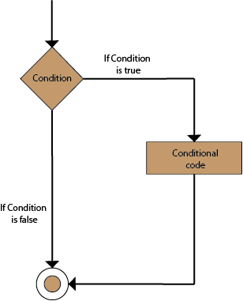
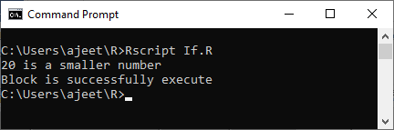
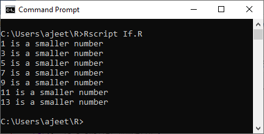
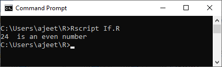
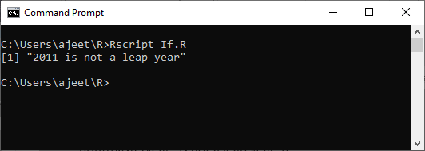

<table>
<tbody><tr><td>

 

<h1 class="h1">R if Statement</h1>

The if statement consists of the Boolean expressions followed by one or more statements. The if statement is the simplest decision-making statement which helps us to take a decision on the basis of the condition.

The if statement is a conditional programming statement which performs the function and displays the information if it is proved true.

The block of code inside the if statement will be executed only when the boolean expression evaluates to be true. If the statement evaluates false, then the code which is mentioned after the condition will run.

The syntax of if statement in R is as follows:
 table:eq(0) > tbody:eq(0) > tr:eq(0) > td:eq(0) > p:eq(3)" data-section-id="" data-ap-network="custom" style="display: block; clear: both; text-align: center; margin: 10px auto; width: 535px; height: 300px; overflow: hidden;"><!--  AP instream video tag Desktop -->

 

 

    

   

 

<ol start="1" class="dp-j"><li class="alt">if(boolean_expression)&nbsp;{&nbsp;&nbsp;</li><li class="">&nbsp;&nbsp;&nbsp;//&nbsp;If&nbsp;the&nbsp;boolean&nbsp;expression&nbsp;is&nbsp;true,&nbsp;then&nbsp;statement(s)&nbsp;will&nbsp;be&nbsp;executed.&nbsp;&nbsp;&nbsp;</li><li class="alt">}&nbsp;&nbsp;</li></ol>
<textarea name="code" class="java" style="display: none;">if(boolean_expression) {
   // If the boolean expression is true, then statement(s) will be executed. 
}
</textarea>

<strong>Flow Chart</strong>

Let see some examples to understand how if statements work and perform a certain task in R.

<h3 class="h3">Example 1</h3>

<ol start="1" class="dp-j"><li class="alt">x&nbsp;&lt;-24L&nbsp;&nbsp;</li><li class="">y&nbsp;&lt;-&nbsp;"shubham"&nbsp;&nbsp;</li><li class="alt">if(is.integer(x))&nbsp;&nbsp;</li><li class="">{&nbsp;&nbsp;</li><li class="alt">&nbsp;&nbsp;&nbsp;&nbsp;print("x&nbsp;is&nbsp;an&nbsp;Integer")&nbsp;&nbsp;</li><li class="">}&nbsp;&nbsp;</li></ol>
<textarea name="code" class="java" style="display: none;">x &lt;-24L
y &lt;- "shubham"
if(is.integer(x))
{
	print("x is an Integer")
}
</textarea>

<strong>Output:</strong>

<h3 class="h3">Example 2</h3>

<ol start="1" class="dp-j"><li class="alt">x&nbsp;&lt;-20&nbsp;&nbsp;</li><li class="">y&lt;-24&nbsp;&nbsp;</li><li class="alt">count=0&nbsp;&nbsp;</li><li class="">if(x&lt;y)&nbsp;&nbsp;</li><li class="alt">{&nbsp;&nbsp;</li><li class="">&nbsp;&nbsp;&nbsp;&nbsp;cat(x,"is&nbsp;a&nbsp;smaller&nbsp;number\n")&nbsp;&nbsp;</li><li class="alt">&nbsp;&nbsp;&nbsp;&nbsp;count=1&nbsp;&nbsp;</li><li class="">}&nbsp;&nbsp;</li><li class="alt">if(count==1){&nbsp;&nbsp;</li><li class="">&nbsp;&nbsp;&nbsp;&nbsp;cat("Block&nbsp;is&nbsp;successfully&nbsp;execute")&nbsp;&nbsp;</li><li class="alt">}&nbsp;&nbsp;</li></ol>
<textarea name="code" class="java" style="display: none;">x &lt;-20
y&lt;-24
count=0
if(x&lt;y)
{
	cat(x,"is a smaller number\n")
	count=1
}
if(count==1){
	cat("Block is successfully execute")
}
</textarea>

<strong>Output:</strong>

<h3 class="h3">Example 3</h3>

<ol start="1" class="dp-j"><li class="alt">x&nbsp;&lt;-1&nbsp;&nbsp;</li><li class="">y&lt;-24&nbsp;&nbsp;</li><li class="alt">count=0&nbsp;&nbsp;</li><li class="">while(x&lt;y){&nbsp;&nbsp;</li><li class="alt">&nbsp;&nbsp;&nbsp;&nbsp;cat(x,"is&nbsp;a&nbsp;smaller&nbsp;number\n")&nbsp;&nbsp;</li><li class="">&nbsp;&nbsp;&nbsp;&nbsp;x=x+2&nbsp;&nbsp;</li><li class="alt">&nbsp;&nbsp;&nbsp;&nbsp;if(x==15)&nbsp;&nbsp;</li><li class="">&nbsp;&nbsp;&nbsp;&nbsp;&nbsp;&nbsp;&nbsp;&nbsp;break&nbsp;&nbsp;</li><li class="alt">}&nbsp;&nbsp;</li></ol>
<textarea name="code" class="java" style="display: none;">x &lt;-1
y&lt;-24
count=0
while(x&lt;y){
	cat(x,"is a smaller number\n")
	x=x+2
	if(x==15)
		break
}
</textarea>

<strong>Output:</strong>

<h3 class="h3">Example 4</h3>

<ol start="1" class="dp-j"><li class="alt">x&nbsp;&lt;-24&nbsp;&nbsp;</li><li class="">if(x%%2==0){&nbsp;&nbsp;</li><li class="alt">&nbsp;&nbsp;&nbsp;&nbsp;cat(x,"&nbsp;is&nbsp;an&nbsp;even&nbsp;number")&nbsp;&nbsp;</li><li class="">}&nbsp;&nbsp;</li><li class="alt">if(x%%2!=0){&nbsp;&nbsp;</li><li class="">&nbsp;&nbsp;&nbsp;&nbsp;cat(x,"&nbsp;is&nbsp;an&nbsp;odd&nbsp;number")&nbsp;&nbsp;</li><li class="alt">}&nbsp;&nbsp;</li></ol>
<textarea name="code" class="java" style="display: none;">x &lt;-24
if(x%%2==0){
	cat(x," is an even number")
}
if(x%%2!=0){
	cat(x," is an odd number")
}
</textarea>

<strong>Output:</strong>

<h3 class="h3">Example 5</h3>

<ol start="1" class="dp-j"><li class="alt">year&nbsp;&nbsp;</li><li class="">1&nbsp;=&nbsp;2011&nbsp;&nbsp;</li><li class="alt">if(year1&nbsp;%%&nbsp;4&nbsp;==&nbsp;0)&nbsp;{&nbsp;&nbsp;</li><li class="">&nbsp;if(year1&nbsp;%%&nbsp;100&nbsp;==&nbsp;0)&nbsp;{&nbsp;&nbsp;&nbsp;</li><li class="alt">&nbsp;&nbsp;&nbsp;&nbsp;&nbsp;if(year1&nbsp;%%&nbsp;400&nbsp;==&nbsp;0)&nbsp;{&nbsp;&nbsp;&nbsp;</li><li class="">&nbsp;&nbsp;&nbsp;&nbsp;&nbsp;&nbsp;&nbsp;&nbsp;&nbsp;cat(year,"is&nbsp;a&nbsp;leap&nbsp;year")&nbsp;&nbsp;&nbsp;</li><li class="alt">&nbsp;&nbsp;&nbsp;&nbsp;&nbsp;&nbsp;&nbsp;&nbsp;}&nbsp;else&nbsp;{&nbsp;&nbsp;</li><li class="">&nbsp;&nbsp;&nbsp;&nbsp;&nbsp;&nbsp;&nbsp;&nbsp;&nbsp;cat(year,"is&nbsp;not&nbsp;a&nbsp;leap&nbsp;year")&nbsp;&nbsp;&nbsp;</li><li class="alt">&nbsp;&nbsp;&nbsp;&nbsp;&nbsp;&nbsp;&nbsp;&nbsp;}&nbsp;&nbsp;</li><li class="">&nbsp;&nbsp;&nbsp;&nbsp;}&nbsp;else&nbsp;{&nbsp;&nbsp;</li><li class="alt">&nbsp;&nbsp;&nbsp;&nbsp;&nbsp;cat(year,"is&nbsp;a&nbsp;leap&nbsp;year")&nbsp;&nbsp;&nbsp;</li><li class="">&nbsp;&nbsp;&nbsp;&nbsp;}&nbsp;&nbsp;</li><li class="alt">}&nbsp;else&nbsp;{&nbsp;&nbsp;</li><li class="">&nbsp;cat(year,"is&nbsp;not&nbsp;a&nbsp;leap&nbsp;year")&nbsp;&nbsp;&nbsp;</li><li class="alt">}&nbsp;&nbsp;</li></ol>
<textarea name="code" class="java" style="display: none;">year
1 = 2011
if(year1 %% 4 == 0) {
 if(year1 %% 100 == 0) { 
	 if(year1 %% 400 == 0) { 
		 cat(year,"is a leap year") 
		} else {
		 cat(year,"is not a leap year") 
		}
	} else {
	 cat(year,"is a leap year") 
	}
} else {
 cat(year,"is not a leap year") 
}
</textarea>

<strong>Output:</strong>

 
  

 

  

 table:eq(0) > tbody:eq(0) > tr:eq(0) > td:eq(0)" data-section-id="" data-ap-network="adpTags" data-render-time="1689707682113" style="display: block; clear: both; text-align: center; margin: 10px auto 30px; width: 0px; height: 0px; overflow: hidden;">

 

</td></tr>
</tbody></table>